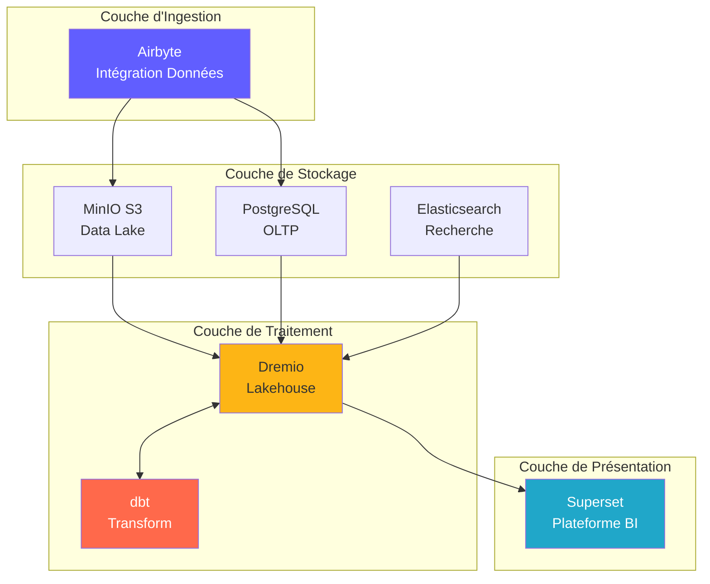
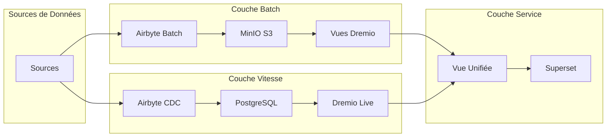
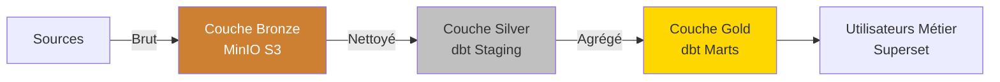
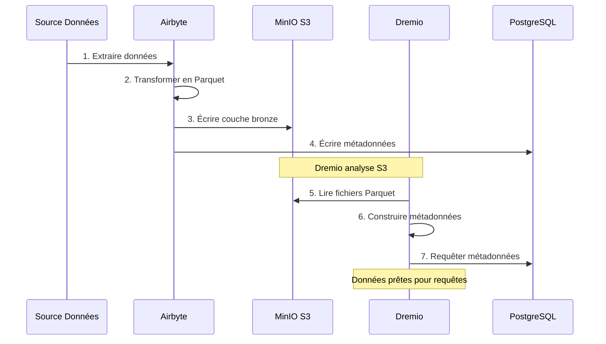
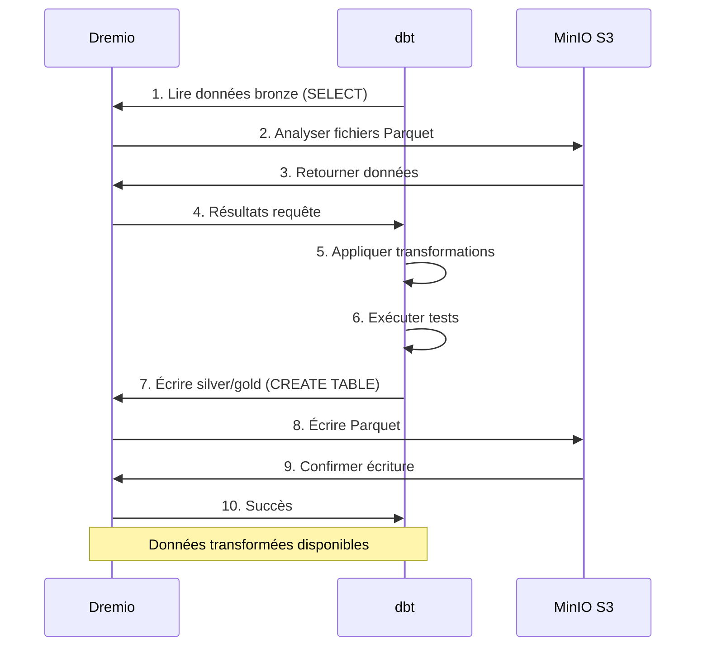
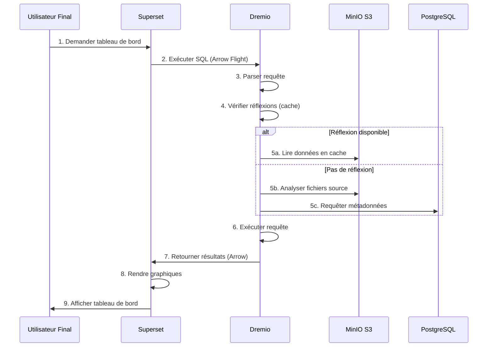
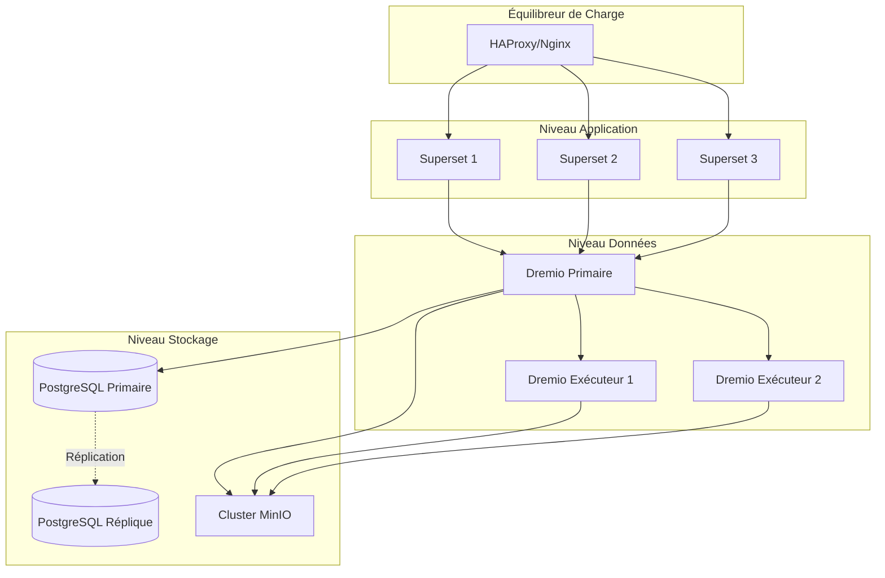
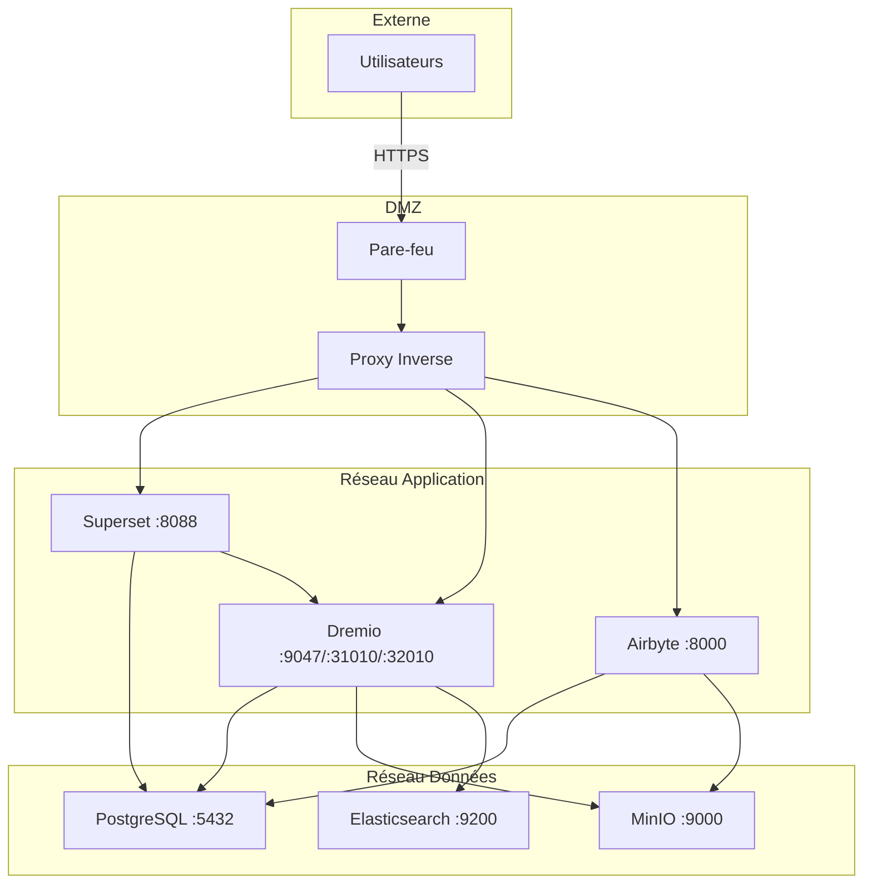
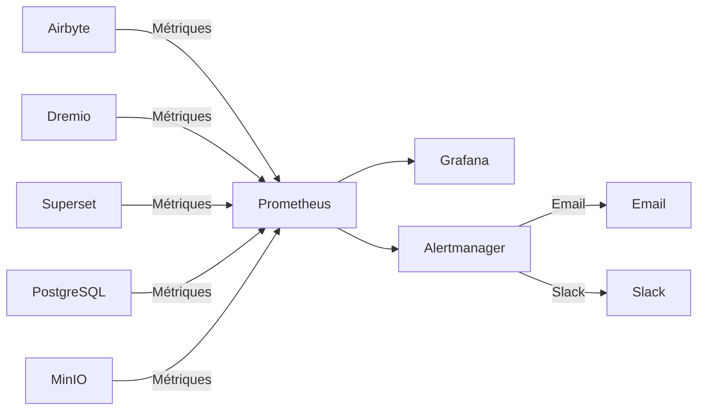

# Tổng quan về kiến ​​trúc

**Phiên bản**: 3.2.0  
**Cập nhật lần cuối**: 2025-10-16  
**Ngôn ngữ**: Tiếng Pháp

---

## Giới thiệu

Nền tảng dữ liệu là kiến ​​trúc dựa trên nền tảng đám mây hiện đại được xây dựng trên công nghệ nguồn mở. Nó cung cấp một giải pháp toàn diện để nhập, lưu trữ, chuyển đổi và trực quan hóa dữ liệu, được thiết kế cho khối lượng công việc phân tích ở quy mô doanh nghiệp.



---

## Nguyên tắc thiết kế

### 1. Nguồn mở đầu tiên

**Triết lý**: Sử dụng công nghệ nguồn mở để tránh sự ràng buộc của nhà cung cấp và duy trì tính linh hoạt.

**Những lợi ích**:
- Không có chi phí cấp phép
- Phát triển cộng đồng
- Khả năng tùy biến đầy đủ
- Kiểm toán an ninh minh bạch
- Khả năng tương thích hệ sinh thái rộng

### 2. Kiến trúc phân lớp

**Triết lý**: Tách các mối quan tâm thành các lớp riêng biệt để có khả năng bảo trì và mở rộng.

**Lớp**:
```
┌─────────────────────────────────────┐
│     Couche de Présentation          │  Superset (BI & Tableaux de Bord)
├─────────────────────────────────────┤
│     Couche Sémantique               │  Dremio (Moteur de Requête)
├─────────────────────────────────────┤
│     Couche de Transformation        │  dbt (Transformation Données)
├─────────────────────────────────────┤
│     Couche de Stockage              │  MinIO, PostgreSQL, Elasticsearch
├─────────────────────────────────────┤
│     Couche d'Ingestion              │  Airbyte (Intégration Données)
└─────────────────────────────────────┘
```

### 3. ELT chứ không phải ETL

**Triết lý**: Tải dữ liệu thô trước, chuyển đổi thành đích (ELT).

**Tại sao là ELT?**
- **Tính linh hoạt**: Chuyển đổi dữ liệu theo nhiều cách mà không cần trích xuất lại
- **Hiệu suất**: Sử dụng tính toán đích cho các phép biến đổi
- **Khả năng kiểm toán**: Dữ liệu thô luôn có sẵn để xác minh
- **Chi phí**: Giảm tải trích xuất trên hệ thống nguồn

**Chảy**:
```
Extract → Load → Transform
(Airbyte) (MinIO/PostgreSQL) (dbt + Dremio)
```

### 4. Mô hình Data Lakehouse

**Triết lý**: Kết hợp tính linh hoạt của hồ dữ liệu với hiệu suất của kho dữ liệu.

**Đặc trưng**:
- **Giao dịch ACID**: Hoạt động dữ liệu đáng tin cậy
- **Ứng dụng lược đồ**: Đảm bảo chất lượng dữ liệu
- **Du hành thời gian**: Truy vấn các phiên bản lịch sử
- **Định dạng mở**: Sàn gỗ, Iceberg, Hồ Delta
- **Truy cập tệp trực tiếp**: Không có khóa độc quyền

### 5. Thiết kế dựa trên nền tảng đám mây

**Triết lý**: Thiết kế cho môi trường được đóng gói và phân phối.

**Thực hiện**:
- Docker container cho tất cả các dịch vụ
- Khả năng mở rộng theo chiều ngang
- Hạ tầng dạng mã
- Không quốc tịch bất cứ nơi nào có thể
- Cấu hình thông qua biến môi trường

---

## Mô hình kiến ​​trúc

### Kiến trúc Lambda (Batch + Stream)



**Lớp hàng loạt** (Dữ liệu lịch sử):
- Khối lượng dữ liệu lớn
- Điều trị định kỳ (hàng giờ/hàng ngày)
- Độ trễ cao chấp nhận được
- Có thể xử lý lại hoàn toàn

**Lớp tốc độ** (Dữ liệu thời gian thực):
- Thu thập dữ liệu thay đổi (CDC)
- Yêu cầu độ trễ thấp
- Chỉ cập nhật gia tăng
- Quản lý dữ liệu gần đây

**Lớp dịch vụ**:
- Hợp nhất các chế độ xem hàng loạt và tốc độ
- Giao diện truy vấn đơn (Dremio)
- Lựa chọn chế độ xem tự động

### Huy chương Kiến trúc (Đồng → Bạc → Vàng)



**Lớp đồng** (Thô):
- Dữ liệu nguyên gốc từ các nguồn
- Không có sự biến đổi
- Toàn bộ lịch sử được bảo tồn
- Airbyte tải ở đây

**Lớp bạc** (Đã làm sạch):
- Chất lượng dữ liệu ứng dụng
- Định dạng chuẩn hóa
- mẫu dàn dựng dbt
- Phân tích sẵn sàng

**Lớp vàng** (Nghề nghiệp):
- Chỉ số tổng hợp
- Ứng dụng logic kinh doanh
- Mô hình dbt của Mart
- Tối ưu hóa cho tiêu dùng

---

## Tương tác giữa các thành phần

### Luồng nhập dữ liệu



### Đường ống chuyển đổi



### Thực thi truy vấn



---

## Mô hình khả năng mở rộng

### Chia tỷ lệ theo chiều ngang

**Dịch vụ không quốc tịch** (có thể phát triển tự do):
- Airbyte Workers: Phát triển để đồng bộ hóa song song
- Dremio Executors: Thang đo hiệu suất truy vấn
- Web Superset: Phát triển cho người dùng cạnh tranh

**Dịch vụ có trạng thái** (yêu cầu phối hợp):
- PostgreSQL: Sao chép bản sao chính
- MinIO: Chế độ phân tán (nhiều nút)
- Elaticsearch: Cụm có sharding

### Chia tỷ lệ theo chiều dọc

**Chuyên sâu về trí nhớ**:
- Dremio: Tăng heap JVM cho các truy vấn lớn
- PostgreSQL: Thêm RAM cho bộ đệm đệm
- Elaticsearch: Nhiều đống hơn cho việc lập chỉ mục

**CPU chuyên sâu**:
- dbt: Nhiều lõi hơn cho các mô hình xây dựng song song
- Airbyte: Chuyển đổi dữ liệu nhanh hơn

### Phân vùng dữ liệu

```sql
-- Exemple: Partitionner par date
CREATE TABLE orders_partitioned (
    order_id INT,
    customer_id INT,
    amount DECIMAL,
    order_date DATE
)
PARTITION BY (DATE_TRUNC('month', order_date))
STORED AS PARQUET;

-- La requête analyse uniquement les partitions pertinentes
SELECT SUM(amount)
FROM orders_partitioned
WHERE order_date >= '2025-01-01'
  AND order_date < '2025-02-01';
-- Analyse uniquement la partition de janvier
```

---

## Tính sẵn sàng cao

### Dự phòng dịch vụ



### Kịch bản thất bại

| Thành phần | Sự cố | Phục hồi |
|---------------|-------|---------|
| **Nhân viên Airbyte** | Sự cố container | Tự động khởi động lại, đồng bộ hóa tiếp tục |
| **Người thực thi Dremio** | Lỗi nút | Yêu cầu được chuyển hướng đến người thực thi khác |
| **PostgreSQL** | Chính không hoạt động | Quảng bá bản sao trong chính |
| **Nút MinIO** | Lỗi đĩa | Mã hóa xóa dữ liệu tái tạo lại |
| **Siêu bộ** | Dịch vụ hết dịch vụ | Cân bằng chuyển hướng lưu lượng truy cập |

### Chiến lược dự phòng

```bash
# Sauvegardes automatisées quotidiennes
0 2 * * * /scripts/backup_all.sh

# backup_all.sh
#!/bin/bash

# Sauvegarder PostgreSQL
pg_dumpall -U postgres > /backups/postgres_$(date +%Y%m%d).sql

# Sauvegarder métadonnées Dremio
tar czf /backups/dremio_$(date +%Y%m%d).tar.gz /opt/dremio/data

# Synchroniser MinIO vers S3 distant
mc mirror MinIOLake/datalake s3-offsite/datalake-backup

# Conserver 30 jours
find /backups -mtime +30 -delete
```

---

## Kiến trúc bảo mật

### An ninh mạng



### Xác thực và ủy quyền

**Xác thực dịch vụ**:
- **Dremio**: Tích hợp LDAP/AD, OAuth2, SAML
- **Superset**: Xác thực cơ sở dữ liệu, LDAP, OAuth2
- **Airbyte**: Xác thực cơ bản, OAuth2 (doanh nghiệp)
- **MinIO**: Chính sách IAM, mã thông báo STS

**Mức độ ủy quyền**:
```yaml
Rôles:
  - Admin:
      - Accès complet à tous les services
      - Gestion utilisateurs
      - Modifications configuration
  
  - Data Engineer:
      - Créer/modifier sources données
      - Exécuter syncs Airbyte
      - Exécuter modèles dbt
      - Créer datasets Dremio
  
  - Analyst:
      - Accès lecture seule données
      - Créer tableaux de bord Superset
      - Requêter datasets Dremio
  
  - Viewer:
      - Voir tableaux de bord uniquement
      - Pas d'accès données
```

### Mã hóa dữ liệu

**Khi nghỉ ngơi**:
- MinIO: Mã hóa phía máy chủ (AES-256)
- PostgreSQL: Mã hóa dữ liệu trong suốt (TDE)
- Elaticsearch: Chỉ mục được mã hóa

**Đang vận chuyển**:
- TLS 1.3 cho tất cả giao tiếp giữa các dịch vụ
- Mũi tên bay với TLS cho Dremio ↔ Superset
- HTTPS cho giao diện web

---

## Giám sát và quan sát

### Bộ sưu tập số liệu



**Các số liệu chính**:
- **Airbyte**: Tỷ lệ đồng bộ hóa thành công, đồng bộ hóa bản ghi, truyền byte
- **Dremio**: Độ trễ yêu cầu, tốc độ truy cập bộ đệm, mức sử dụng tài nguyên
- **dbt**: Thời gian xây dựng mô hình, test thất bại
- **Superset**: Thời gian tải trang tổng quan, số người dùng đang hoạt động
- **Cơ sở hạ tầng**: CPU, bộ nhớ, đĩa, mạng

### Ghi nhật ký

**Ghi nhật ký tập trung**:
```yaml
Stack ELK:
  - Elasticsearch: Stocker logs
  - Logstash: Traiter logs
  - Kibana: Visualiser logs

Sources de Logs:
  - Logs application (format JSON)
  - Logs d'accès
  - Logs d'audit
  - Logs d'erreur
```

### Truy tìm

**Theo dõi phân tán**:
- Tích hợp Jaeger hoặc Zipkin
- Theo dõi yêu cầu giữa các dịch vụ
- Xác định điểm nghẽn
- Gỡ lỗi các vấn đề về hiệu suất

---

## Cấu trúc liên kết triển khai

### Môi trường phát triển

```yaml
Hôte Unique:
  Ressources: 8 Go RAM, 4 CPUs
  Services: Tous sur une machine
  Stockage: Volumes locaux
  Réseau: Réseau bridge
  Cas d'usage: Développement, tests
```

### Môi trường dàn dựng

```yaml
Multi-Hôtes:
  Ressources: 16 Go RAM, 8 CPUs par hôte
  Services: Répartis sur 2-3 hôtes
  Stockage: NFS partagé ou MinIO distribué
  Réseau: Réseau overlay
  Cas d'usage: Tests pré-production, UAT
```

### Môi trường sản xuất

```yaml
Cluster Kubernetes:
  Ressources: Auto-scaling selon charge
  Services: Conteneurisés, répliqués
  Stockage: Volumes persistants (SSD)
  Réseau: Service mesh (Istio)
  Haute Disponibilité: Déploiement multi-zones
  Cas d'usage: Charges production
```

---

## Biện minh cho các lựa chọn công nghệ

### Tại sao lại là Airbyte?

- **Hơn 300 đầu nối**: Tích hợp sẵn
- **Nguồn mở**: Không khóa nhà cung cấp
- **Cộng đồng tích cực**: 12k+ sao GitHub
- **Hỗ trợ của CDC**: Thu thập dữ liệu theo thời gian thực
- **Tiêu chuẩn hóa**: Tích hợp dbt tích hợp

### Tại sao lại là Dremio?

- **Tăng tốc truy vấn**: Truy vấn nhanh hơn 10-100 lần
- **Arrow Flight**: Truyền dữ liệu hiệu suất cao
- **Khả năng tương thích với hồ dữ liệu**: Không có chuyển động dữ liệu
- **Tự phục vụ**: Người dùng doanh nghiệp khám phá dữ liệu
- **Có lãi**: Giảm chi phí kho bãi

### Tại sao lại là dbt?

- **Dựa trên SQL**: Quen thuộc với các nhà phân tích
- **Kiểm soát phiên bản**: Tích hợp Git
- **Thử nghiệm**: Kiểm tra chất lượng dữ liệu tích hợp
- **Tài liệu**: Tài liệu được tạo tự động
- **Cộng đồng**: có sẵn hơn 5k gói

### Tại sao lại là Superset?

- **Giao diện người dùng hiện đại**: Giao diện trực quan
- **SQL IDE**: Khả năng truy vấn nâng cao
- **Hình ảnh trực quan phong phú**: Hơn 50 loại đồ họa
- **Mở rộng**: Plugin tùy chỉnh
- **Mã nguồn mở**: Nền tảng Apache được hỗ trợ

### Tại sao lại là PostgreSQL?

- **Độ tin cậy**: Tuân thủ ACID
- **Hiệu suất**: Đã được chứng minh trên quy mô lớn
- **Tính năng**: JSON, tìm kiếm toàn văn, tiện ích mở rộng
- **Cộng đồng**: Hệ sinh thái trưởng thành
- **Chi phí**: Nguồn mở và miễn phí

### Tại sao lại là MinIO?

- **Khả năng tương thích S3**: API tiêu chuẩn ngành
- **Hiệu suất**: Tốc độ dòng chảy cao
- **Xóa mã hóa**: Độ bền của dữ liệu
- **Đa đám mây**: Triển khai ở mọi nơi
- **Tiết kiệm chi phí**: Tự lưu trữ thay thế

---

## Sự phát triển của kiến ​​trúc trong tương lai

### Những cải tiến theo kế hoạch

1. **Danh mục dữ liệu** (Tích hợp OpenMetadata)
   - Quản lý siêu dữ liệu
   - Theo dõi dòng dõi
   - Khám phá dữ liệu

2. **Chất lượng dữ liệu** (Kỳ vọng lớn)
   - Xác thực tự động
   - Phát hiện bất thường
   - Bảng điều khiển chất lượng

3. **Hoạt động ML** (MLflow)
   - Quy trình đào tạo mô hình
   - Đăng ký người mẫu
   - Tự động hóa triển khai

4. **Xử lý luồng** (Apache Flink)
   - Chuyển đổi thời gian thực
   - Xử lý sự kiện phức tạp
   - Phân tích phát trực tuyến

5. **Quản trị dữ liệu** (Apache Atlas)
   - Ứng dụng chính sách
   - Kiểm tra truy cập
   - Báo cáo tuân thủ

---

## Tài liệu tham khảo

- [Chi tiết thành phần](comments.md)
- [Luồng dữ liệu](data-flow.md)
- [Hướng dẫn triển khai](deployment.md)
- [Tích hợp Airbyte](../guides/airbyte-integration.md)

---

**Phiên bản tổng quan về kiến ​​trúc**: 3.2.0  
**Cập nhật lần cuối**: 2025-10-16  
**Được duy trì bởi**: Nhóm nền tảng dữ liệu