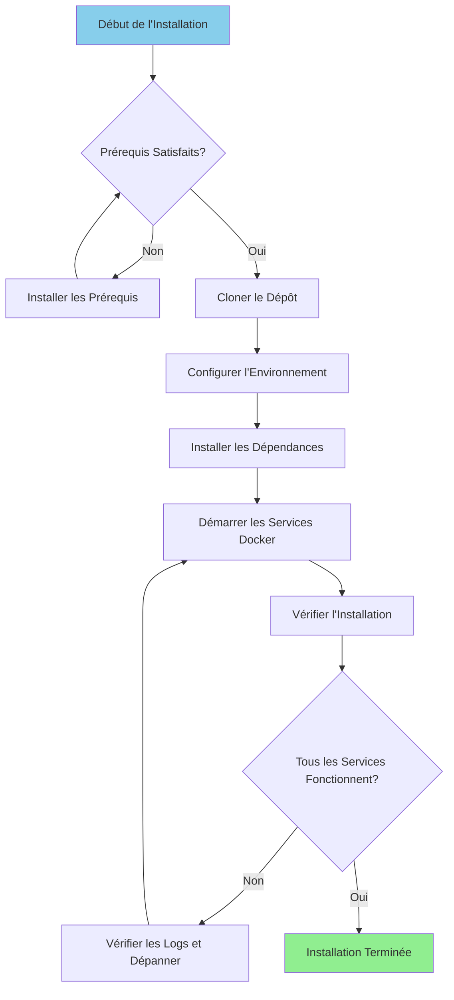

#Hướng dẫn cài đặt

**Phiên bản**: 3.2.0  
**Cập nhật lần cuối**: 2025-10-16  
**Ngôn ngữ**: Tiếng Pháp

---

## Tổng quan

Hướng dẫn này cung cấp hướng dẫn từng bước để cài đặt và định cấu hình nền tảng dữ liệu hoàn chỉnh, bao gồm Airbyte, Dremio, dbt, Apache Superset và cơ sở hạ tầng hỗ trợ.



---

## Điều kiện tiên quyết

### Yêu cầu hệ thống

**Yêu cầu tối thiểu:**
- **CPU**: 4 lõi (khuyến nghị 8+)
- **RAM**: 8 GB (khuyến nghị 16+ GB)
- **Dung lượng ổ đĩa**: Có sẵn 20 GB (khuyến nghị trên 50 GB)
- **Mạng**: Kết nối Internet ổn định cho Docker image

**Hệ điều hành:**
- Linux (Ubuntu 20.04+, CentOS 8+, Debian 11+)
- macOS (11.0+)
- Windows 10/11 với WSL2

### Phần mềm cần thiết

#### 1. Docker

**Phiên bản**: 20.10 trở lên

**Cơ sở:**

**Linux:**
```bash
# Installer Docker
curl -fsSL https://get.docker.com -o get-docker.sh
sudo sh get-docker.sh

# Ajouter l'utilisateur au groupe docker
sudo usermod -aG docker $USER

# Démarrer le service Docker
sudo systemctl start docker
sudo systemctl enable docker

# Vérifier l'installation
docker --version
```

**macOS:**
```bash
# Télécharger et installer Docker Desktop depuis:
# https://www.docker.com/products/docker-desktop

# Vérifier l'installation
docker --version
```

**Cửa sổ:**
```powershell
# Installer WSL2 d'abord
wsl --install

# Télécharger et installer Docker Desktop depuis:
# https://www.docker.com/products/docker-desktop

# Vérifier l'installation
docker --version
```

#### 2. Soạn Docker

**Phiên bản**: 2.0 trở lên

**Cơ sở:**

```bash
# Linux
sudo curl -L "https://github.com/docker/compose/releases/latest/download/docker-compose-$(uname -s)-$(uname -m)" -o /usr/local/bin/docker-compose
sudo chmod +x /usr/local/bin/docker-compose

# Vérifier l'installation
docker-compose --version
```

**Lưu ý**: Docker Desktop dành cho macOS và Windows bao gồm Docker Compose.

#### 3. Python

**Phiên bản**: 3.11 trở lên

**Cơ sở:**

**Linux (Ubuntu/Debian):**
```bash
sudo apt update
sudo apt install python3.11 python3.11-venv python3-pip
```

**macOS:**
```bash
brew install python@3.11
```

**Cửa sổ:**
```powershell
# Télécharger l'installateur depuis python.org
# Ou utiliser winget:
winget install Python.Python.3.11
```

**Xác minh:**
```bash
python --version  # ou python3 --version
pip --version     # ou pip3 --version
```

#### 4. Git

**Cơ sở:**

```bash
# Linux
sudo apt install git  # Ubuntu/Debian
sudo yum install git  # CentOS/RHEL

# macOS
brew install git

# Windows
winget install Git.Git
```

**Xác minh:**
```bash
git --version
```

---

## Các bước cài đặt

### Bước 1: Sao chép kho lưu trữ

```bash
# Cloner le dépôt
git clone https://github.com/your-org/dremiodbt.git

# Naviguer vers le répertoire du projet
cd dremiodbt

# Vérifier le contenu
ls -la
```

**Cơ cấu dự kiến:**
```
dremiodbt/
├── docker-compose.yml
├── docker-compose-airbyte.yml
├── README.md
├── requirements.txt
├── dbt/
├── dremio_connector/
├── docs/
└── scripts/
```

### Bước 2: Cấu hình môi trường

#### Tạo tệp môi trường

```bash
# Copier le fichier d'environnement exemple
cp .env.example .env

# Éditer la configuration (optionnel)
nano .env  # ou utiliser votre éditeur préféré
```

#### Biến môi trường

**Cấu hình cơ bản:**
```bash
# Projet
PROJECT_NAME=dremiodbt
ENVIRONMENT=development

# Réseau Docker
NETWORK_NAME=dremio_network

# PostgreSQL
POSTGRES_HOST=postgres
POSTGRES_PORT=5432
POSTGRES_DB=dremio_db
POSTGRES_USER=postgres
POSTGRES_PASSWORD=postgres123

# Dremio
DREMIO_VERSION=26.0
DREMIO_HTTP_PORT=9047
DREMIO_FLIGHT_PORT=32010
DREMIO_ADMIN_USER=admin
DREMIO_ADMIN_PASSWORD=admin123

# Airbyte
AIRBYTE_VERSION=0.50.33
AIRBYTE_HTTP_PORT=8000
AIRBYTE_API_PORT=8001

# Superset
SUPERSET_VERSION=3.0
SUPERSET_HTTP_PORT=8088
SUPERSET_ADMIN_USER=admin
SUPERSET_ADMIN_PASSWORD=admin

# MinIO
MINIO_VERSION=latest
MINIO_API_PORT=9000
MINIO_CONSOLE_PORT=9001
MINIO_ROOT_USER=minioadmin
MINIO_ROOT_PASSWORD=minioadmin123

# Elasticsearch
ELASTIC_VERSION=8.15.0
ELASTIC_HTTP_PORT=9200
```

### Bước 3: Cài đặt Python Dependency

#### Tạo môi trường ảo

```bash
# Créer l'environnement virtuel
python -m venv venv

# Activer l'environnement virtuel
# Linux/macOS:
source venv/bin/activate

# Windows:
.\venv\Scripts\activate
```

#### Yêu cầu cài đặt

```bash
# Mettre à jour pip
pip install --upgrade pip

# Installer les dépendances
pip install -r requirements.txt

# Vérifier l'installation
pip list
```

**Các gói cài đặt chính:**
- `pyarrow>=21.0.0` - Khách hàng của Arrow Flight
- `pandas>=2.3.0` - Thao tác dữ liệu
- `dbt-core>=1.10.0` - Chuyển đổi dữ liệu
- `sqlalchemy>=2.0.0` - Kết nối cơ sở dữ liệu
- `pyyaml>=6.0.0` - Quản lý cấu hình

### Bước 4: Khởi động Docker Services

#### Bắt đầu dịch vụ chính

```bash
# Démarrer tous les services
docker-compose up -d

# Ou utiliser Makefile (si disponible)
make up
```

**Dịch vụ đã bắt đầu:**
- PostgreSQL (cổng 5432)
- Dremio (cổng 9047, 32010)
- Superset Apache (cổng 8088)
- MinIO (cổng 9000, 9001)
- Elaticsearch (cổng 9200)

#### Khởi động Airbyte (Soạn riêng)

```bash
# Démarrer les services Airbyte
docker-compose -f docker-compose-airbyte.yml up -d
```

**Dịch vụ Airbyte đã bắt đầu:**
- Máy chủ Airbyte (cổng 8001)
- Giao diện người dùng web Airbyte (cổng 8000)
- Công nhân Airbyte
- Airbyte tạm thời
- Cơ sở dữ liệu Airbyte

#### Kiểm tra trạng thái dịch vụ

```bash
# Voir les conteneurs en cours d'exécution
docker-compose ps

# Voir tous les conteneurs (incluant Airbyte)
docker ps

# Voir les logs
docker-compose logs -f

# Voir les logs Airbyte
docker-compose -f docker-compose-airbyte.yml logs -f
```

---

## Xác minh

### Bước 5: Kiểm tra dịch vụ

#### 1. PostgreSQL

```bash
# Tester la connexion
docker exec -it postgres psql -U postgres -d dremio_db -c "SELECT version();"
```

**Sản lượng dự kiến:**
```
PostgreSQL 16.x on x86_64-pc-linux-gnu
```

#### 2. Dremio

**Giao diện web:**
```
http://localhost:9047
```

**Kết nối đầu tiên:**
- Tên người dùng: `admin`
- Mật khẩu: `admin123`
- Bạn sẽ được nhắc tạo tài khoản quản trị viên khi truy cập lần đầu

**Kiểm tra kết nối:**
```bash
# Tester le point de terminaison HTTP
curl http://localhost:9047/apiv2/login
```

#### 3. Airbyte

**Giao diện web:**
```
http://localhost:8000
```

**Số nhận dạng mặc định:**
- Email: `airbyte@example.com`
- Mật khẩu: `password`

**Kiểm tra API:**
```bash
# Vérification de santé
curl http://localhost:8001/health
```

**Phản hồi mong đợi:**
```json
{
  "status": "ok",
  "timestamp": "2025-10-16T12:00:00Z"
}
```

#### 4. Siêu tập hợp Apache

**Giao diện web:**
```
http://localhost:8088
```

**Số nhận dạng mặc định:**
- Tên người dùng: `admin`
- Mật khẩu: `admin`

**Kiểm tra kết nối:**
```bash
curl http://localhost:8088/health
```

#### 5. MiniIO

**Giao diện người dùng bảng điều khiển:**
```
http://localhost:9001
```

**Thông tin xác thực:**
- Tên người dùng: `minioadmin`
- Mật khẩu: `minioadmin123`

**Kiểm tra API S3:**
```bash
# Installer le client MinIO
wget https://dl.min.io/client/mc/release/linux-amd64/mc
chmod +x mc

# Configurer
./mc alias set local http://localhost:9000 minioadmin minioadmin123

# Tester
./mc ls local
```

#### 6. Elaticsearch

**Kiểm tra kết nối:**
```bash
# Vérification de santé
curl http://localhost:9200/_cluster/health

# Obtenir les informations
curl http://localhost:9200
```

**Phản hồi mong đợi:**
```json
{
  "name": "elasticsearch",
  "cluster_name": "docker-cluster",
  "version": {
    "number": "8.15.0"
  }
}
```

### Bước 6: Chạy Health Checks

```bash
# Exécuter le script de vérification de santé complet
python scripts/health_check.py

# Ou utiliser Makefile
make health-check
```

**Sản lượng dự kiến:**
```
✓ PostgreSQL: En cours d'exécution (port 5432)
✓ Dremio: En cours d'exécution (ports 9047, 32010)
✓ Airbyte: En cours d'exécution (ports 8000, 8001)
✓ Superset: En cours d'exécution (port 8088)
✓ MinIO: En cours d'exécution (ports 9000, 9001)
✓ Elasticsearch: En cours d'exécution (port 9200)

Tous les services sont opérationnels!
```

---

## Cấu hình sau khi cài đặt

### 1. Khởi tạo Dremio

```bash
# Exécuter le script d'initialisation
python scripts/init_dremio.py
```

**Tạo:**
- Người dùng quản trị
- Nguồn mặc định (PostgreSQL, MinIO)
- Tập dữ liệu mẫu

### 2. Khởi tạo Superset

```bash
# Initialiser la base de données
docker exec -it superset superset db upgrade

# Créer un utilisateur administrateur (si inexistant)
docker exec -it superset superset fab create-admin \
    --username admin \
    --firstname Admin \
    --lastname User \
    --email admin@example.com \
    --password admin

# Initialiser Superset
docker exec -it superset superset init
```

### 3. Cấu hình dbt

```bash
# Naviguer vers le répertoire dbt
cd dbt

# Tester la connexion
dbt debug

# Exécuter les modèles initiaux
dbt run

# Exécuter les tests
dbt test
```

### 4. Cấu hình Airbyte

**Qua Giao diện Web (http://localhost:8000):**

1. Hoàn tất trình hướng dẫn thiết lập
2. Định cấu hình nguồn đầu tiên (ví dụ: PostgreSQL)
3. Định cấu hình đích (ví dụ: MinIO S3)
4. Tạo kết nối
5. Chạy lần đồng bộ đầu tiên

**Qua API:**
```bash
# Voir docs/i18n/fr/guides/airbyte-integration.md pour les détails
python scripts/configure_airbyte.py
```

---

## Cấu trúc thư mục sau khi cài đặt

```
dremiodbt/
├── venv/                          # Environnement virtuel Python
├── data/                          # Stockage de données local
│   ├── dremio/                    # Métadonnées Dremio
│   ├── postgres/                  # Données PostgreSQL
│   └── minio/                     # Données MinIO
├── logs/                          # Logs applicatifs
│   ├── dremio.log
│   ├── airbyte.log
│   ├── superset.log
│   └── dbt.log
├── dbt/
│   ├── models/                    # Modèles dbt
│   ├── tests/                     # Tests dbt
│   ├── target/                    # SQL compilé
│   └── logs/                      # Logs dbt
└── docker-volume/                 # Volumes persistants Docker
    ├── db-data/                   # Données de base de données
    ├── minio-data/                # Stockage objet
    └── elastic-data/              # Index de recherche
```

---

## Khắc phục sự cố

### Các vấn đề thường gặp

#### 1. Cổng đã được sử dụng

**Lỗi:**
```
Error: bind: address already in use
```

**Giải pháp:**
```bash
# Trouver le processus utilisant le port (exemple: 9047)
sudo lsof -i :9047

# Terminer le processus
sudo kill -9 <PID>

# Ou changer le port dans docker-compose.yml
```

#### 2. Không đủ bộ nhớ

**Lỗi:**
```
ERROR: Insufficient memory available
```

**Giải pháp:**
```bash
# Augmenter l'allocation mémoire Docker
# Docker Desktop: Paramètres > Ressources > Mémoire (16Go recommandés)

# Linux: Éditer /etc/docker/daemon.json
{
  "default-ulimits": {
    "memlock": {
      "Hard": -1,
      "Name": "memlock",
      "Soft": -1
    }
  }
}

# Redémarrer Docker
sudo systemctl restart docker
```

#### 3. Dịch vụ không khởi động

**Kiểm tra nhật ký:**
```bash
# Voir tous les logs des services
docker-compose logs

# Voir un service spécifique
docker-compose logs dremio
docker-compose logs airbyte-server

# Suivre les logs en temps réel
docker-compose logs -f
```

#### 4. Sự cố mạng

**Đặt lại mạng Docker:**
```bash
# Arrêter tous les services
docker-compose down
docker-compose -f docker-compose-airbyte.yml down

# Supprimer le réseau
docker network rm dremio_network

# Redémarrer les services
docker-compose up -d
docker-compose -f docker-compose-airbyte.yml up -d
```

#### 5. Vấn đề về quyền (Linux)

**Giải pháp:**
```bash
# Corriger les permissions des répertoires de données
sudo chown -R $USER:$USER data/ docker-volume/

# Corriger les permissions du socket Docker
sudo chmod 666 /var/run/docker.sock
```

---

## Gỡ cài đặt

### Dừng dịch vụ

```bash
# Arrêter les services principaux
docker-compose down

# Arrêter Airbyte
docker-compose -f docker-compose-airbyte.yml down
```

### Xóa dữ liệu (Tùy chọn)

```bash
# Supprimer les volumes (ATTENTION: Supprime toutes les données)
docker-compose down -v
docker-compose -f docker-compose-airbyte.yml down -v

# Supprimer les répertoires de données locaux
rm -rf data/ docker-volume/ logs/
```

### Xóa hình ảnh Docker

```bash
# Lister les images
docker images | grep dremio

# Supprimer des images spécifiques
docker rmi dremio/dremio-oss:24.0
docker rmi airbyte/server:0.50.33
docker rmi apache/superset:3.0

# Supprimer toutes les images non utilisées
docker image prune -a
```

---

## Các bước tiếp theo

Sau khi cài đặt thành công:

1. **Định cấu hình nguồn dữ liệu** - Xem [Hướng dẫn cấu hình](configuration.md)
2. **Hướng dẫn các bước đầu tiên** - Xem [Các bước đầu tiên](first-steps.md)
3. **Cấu hình Airbyte** - Xem [Hướng dẫn tích hợp Airbyte](../guides/airbyte-integration.md)
4. **Thiết lập Dremio** - Xem [Hướng dẫn thiết lập Dremio](../guides/dremio-setup.md)
5. **Tạo mô hình dbt** - Xem [Hướng dẫn phát triển dbt](../guides/dbt-development.md)
6. **Tạo trang tổng quan** - Xem [Hướng dẫn bảng điều khiển Superset](../guides/superset-dashboards.md)

---

## Ủng hộ

Đối với các vấn đề cài đặt:

- **Tài liệu**: [Hướng dẫn khắc phục sự cố](../guides/troubleshooting.md)
- **Vấn đề về GitHub**: https://github.com/your-org/dremiodbt/issues
- **Cộng đồng**: https://github.com/your-org/dremiodbt/discussions

---

**Phiên bản hướng dẫn cài đặt**: 3.2.0  
**Cập nhật lần cuối**: 2025-10-16  
**Được duy trì bởi**: Nhóm nền tảng dữ liệu