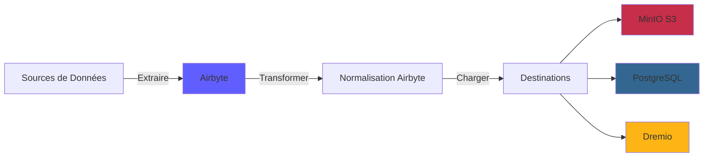
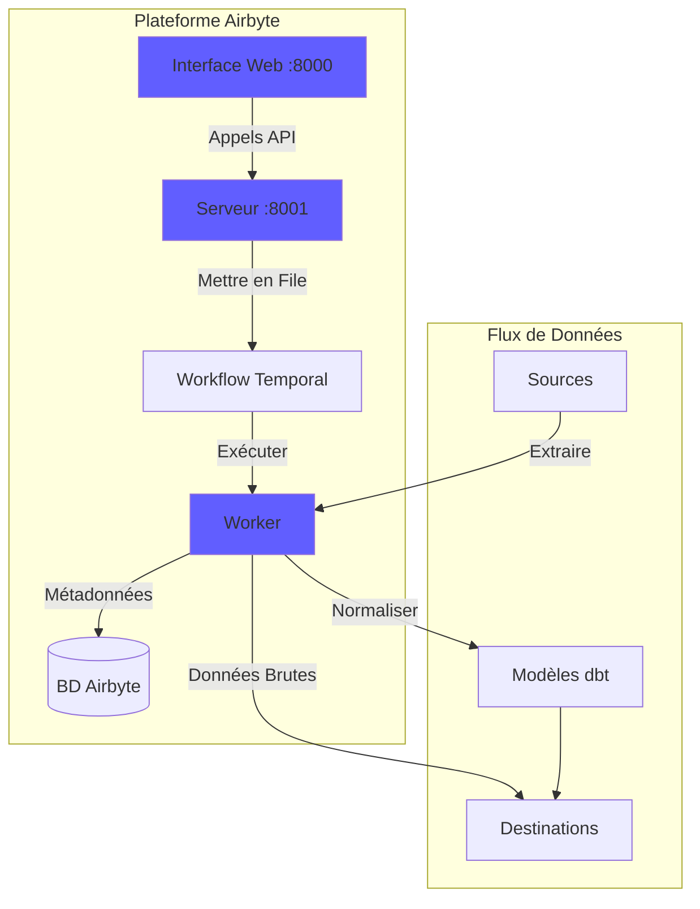
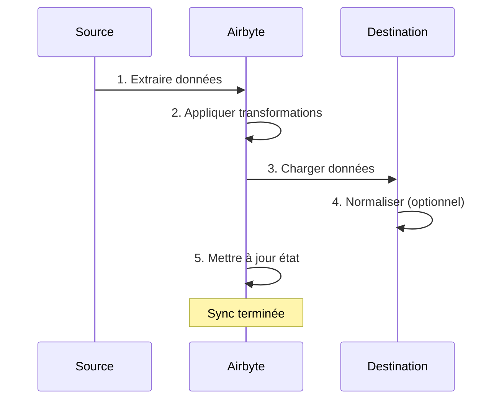
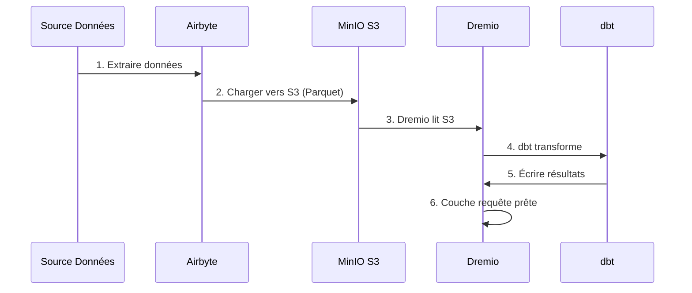

# Hướng dẫn tích hợp Airbyte

**Phiên bản**: 3.2.0  
**Cập nhật lần cuối**: Ngày 16 tháng 10 năm 2025  
**Ngôn ngữ**: Tiếng Pháp

---

## Tổng quan

Airbyte là một nền tảng tích hợp dữ liệu nguồn mở giúp đơn giản hóa việc di chuyển dữ liệu từ nhiều nguồn khác nhau đến đích. Hướng dẫn này đề cập đến việc tích hợp Airbyte vào nền tảng dữ liệu, định cấu hình trình kết nối và thiết lập đường dẫn dữ liệu.



---

##Airbyte là gì?

### Các tính năng chính

- **300+ Trình kết nối dựng sẵn**: API, cơ sở dữ liệu, tệp, ứng dụng SaaS
- **Nguồn mở**: Tự lưu trữ với toàn quyền kiểm soát dữ liệu
- **Thu thập dữ liệu thay đổi (CDC)**: Đồng bộ hóa dữ liệu theo thời gian thực
- **Trình kết nối tùy chỉnh**: Xây dựng trình kết nối bằng Python hoặc CDK mã thấp
- **Chuẩn hóa dữ liệu**: Chuyển đổi JSON thô thành các bảng có cấu trúc
- **Giám sát & Cảnh báo**: Theo dõi trạng thái đồng bộ hóa và chất lượng dữ liệu

### Ngành kiến ​​​​trúc



---

## Cơ sở

### Bắt đầu nhanh

Airbyte được bao gồm trong nền tảng. Bắt đầu nó với:

```bash
# Démarrer services Airbyte
docker-compose -f docker-compose-airbyte.yml up -d

# Vérifier statut
docker-compose -f docker-compose-airbyte.yml ps

# Voir logs
docker-compose -f docker-compose-airbyte.yml logs -f
```

### Dịch vụ đã bắt đầu

| Dịch vụ | Cảng | Mô tả |
|--------|------|-------------|
| **airbyte-webapp** | 8000 | Giao diện người dùng web |
| **máy chủ airbyte** | 8001 | Máy chủ API |
| **nhân viên airbyte** | - | Công cụ thực hiện công việc |
| **airbyte-thời gian** | 7233 | Điều phối quy trình làm việc |
| **airbyte-db** | 5432 | Cơ sở dữ liệu siêu dữ liệu (PostgreSQL) |

### Truy cập lần đầu

**Giao diện web:**
```
http://localhost:8000
```

**Số nhận dạng mặc định:**
- **Email**: `airbyte@example.com`
- **Mật khẩu**: `password`

**Đổi mật khẩu** khi đăng nhập lần đầu để bảo mật.

---

## Cấu hình

### Trình hướng dẫn cấu hình

Trong lần truy cập đầu tiên, hãy hoàn thành trình hướng dẫn cấu hình:

1. **Tùy chọn email**: Định cấu hình thông báo
2. **Nơi lưu trữ dữ liệu**: Chọn vị trí lưu trữ dữ liệu
3. **Thống kê sử dụng ẩn danh**: Chấp nhận/từ chối đo từ xa

### Cài đặt không gian làm việc

Điều hướng tới **Cài đặt > Không gian làm việc**:

```yaml
Nom Workspace: Production Data Platform
ID Workspace: default
Définition Namespace: Destination Default
Format Namespace: ${SOURCE_NAMESPACE}
```

### Giới hạn tài nguyên

**Tệp**: `config/airbyte/config.yaml`

```yaml
# Allocation ressources par connecteur
resources:
  source:
    cpu_limit: "1.0"
    memory_limit: "1Gi"
    cpu_request: "0.25"
    memory_request: "256Mi"
  
  destination:
    cpu_limit: "1.0"
    memory_limit: "1Gi"
    cpu_request: "0.25"
    memory_request: "256Mi"
  
  orchestrator:
    cpu_limit: "0.5"
    memory_limit: "512Mi"
```

---

## Trình kết nối

### Trình kết nối nguồn

#### Nguồn PostgreSQL

**Ca sử dụng**: Trích xuất dữ liệu từ cơ sở dữ liệu giao dịch

**Cấu hình:**

1. Điều hướng đến **Nguồn > Nguồn mới**
2. Chọn **PostgreSQL**
3. Cấu hình kết nối:

```yaml
Host: postgres
Port: 5432
Database: source_db
Username: readonly_user
Password: [MOT_DE_PASSE_SÉCURISÉ]
SSL Mode: prefer

Méthode Réplication: Standard
  # Ou CDC pour changements temps réel:
  # Méthode Réplication: Logical Replication (CDC)
```

**Kiểm tra kết nối** → **Thiết lập nguồn**

#### Nguồn API REST

**Trường hợp sử dụng**: Trích xuất dữ liệu từ API

**Cấu hình:**

```yaml
Name: External API
URL Base: https://api.example.com/v1
Authentication:
  Type: Bearer Token
  Token: [API_TOKEN]

Endpoints:
  - name: customers
    path: /customers
    http_method: GET
    
  - name: orders
    path: /orders
    http_method: GET
    params:
      start_date: "{{ config['start_date'] }}"
```

#### Tệp nguồn (CSV)

**Trường hợp sử dụng**: Nhập tệp CSV

**Cấu hình:**

```yaml
Dataset Name: sales_data
URL: https://storage.example.com/sales.csv
Format: CSV
Provider:
  Storage: HTTPS
  User Provided Storage:
    URL: https://storage.example.com/sales.csv
```

#### Nguồn chung

| Nguồn | Trường hợp sử dụng | Hỗ trợ CDC |
|--------|--------|-------------|
| **PostgreSQL** | Truyện tranh giao dịch | ✅ Có |
| **MySQL** | Truyện tranh giao dịch | ✅ Có |
| **MongoDB** | Tài liệu NoSQL | ✅ Có |
| **Lực lượng bán hàng** | Dữ liệu CRM | ❌ Không |
| **Google Trang tính** | Bảng tính | ❌ Không |
| **Sọc** | Dữ liệu thanh toán | ❌ Không |
| **API REST** | API tùy chỉnh | ❌ Không |
| **S3** | Lưu trữ tập tin | ❌ Không |

### Trình kết nối đích

#### Đích đến của MinIO S3

**Trường hợp sử dụng**: Lưu trữ dữ liệu thô trong hồ dữ liệu

**Cấu hình:**

1. Điều hướng đến **Điểm đến > Điểm đến mới**
2. Chọn **S3**
3. Cấu hình kết nối:

```yaml
S3 Bucket Name: datalake
S3 Bucket Path: airbyte-data/${NAMESPACE}/${STREAM_NAME}
S3 Bucket Region: us-east-1

# Point de terminaison MinIO
S3 Endpoint: http://minio:9000
Access Key ID: [MINIO_ROOT_USER]
Secret Access Key: [MINIO_ROOT_PASSWORD]

Output Format:
  Format Type: Parquet
  Compression: GZIP
  Block Size: 128MB
```

**Kiểm tra kết nối** → **Thiết lập đích**

#### Đích PostgreSQL

**Trường hợp sử dụng**: Tải dữ liệu đã chuyển đổi để phân tích

**Cấu hình:**

```yaml
Host: postgres
Port: 5432
Database: analytics_db
Username: analytics_user
Password: [MOT_DE_PASSE_SÉCURISÉ]
Default Schema: public

Normalization:
  Mode: Basic
  # Crée tables normalisées depuis JSON imbriqué
```

#### Đích đến Dremio

**Trường hợp sử dụng**: Tải trực tiếp vào kho dữ liệu

**Cấu hình:**

```yaml
Host: dremio
Port: 32010
Project: Production
Dataset: airbyte_data
Username: dremio_user
Password: [DREMIO_PASSWORD]

Connection Type: Arrow Flight
SSL: false
```

---

## Kết nối

### Tạo kết nối

Một kết nối liên kết một nguồn với một đích.



#### Từng bước

1. **Điều hướng đến Kết nối > Kết nối mới**

2. **Chọn nguồn**: Chọn nguồn đã định cấu hình (ví dụ: PostgreSQL)

3. **Chọn đích**: Chọn đích đến (ví dụ: MinIO S3)

4. **Định cấu hình đồng bộ hóa**:

```yaml
Nom Connexion: PostgreSQL → MinIO
Fréquence Réplication: Every 24 hours
Namespace Destination: Custom
  Format Namespace: production_${SOURCE_NAMESPACE}

Streams:
  - customers
    Mode Sync: Full Refresh | Overwrite
    Champ Curseur: updated_at
    Clé Primaire: customer_id
    
  - orders
    Mode Sync: Incremental | Append
    Champ Curseur: created_at
    Clé Primaire: order_id
    
  - products
    Mode Sync: Full Refresh | Overwrite
    Clé Primaire: product_id
```

5. **Cấu hình chuẩn hóa** (tùy chọn):

```yaml
Normalization:
  Enable: true
  Option: Basic Normalization
  # Convertit JSON imbriqué en tables plates
```

6. **Kiểm tra kết nối** → **Thiết lập kết nối**

### Các chế độ đồng bộ hóa

| Thời trang | Mô tả | Trường hợp sử dụng |
|------|-------------|-------------|
| **Làm mới hoàn toàn\| Ghi đè** | Thay thế tất cả dữ liệu | Bảng kích thước |
| **Làm mới hoàn toàn\| Nối** | Thêm tất cả hồ sơ | Theo dõi lịch sử |
| **Gia tăng\| Nối** | Thêm bản ghi mới/cập nhật | Bảng sự kiện |
| **Gia tăng\| Đã khấu trừ** | Cập nhật hồ sơ hiện có | SCD Loại 1 |

### Lập kế hoạch

**Tùy chọn tần số:**
- **Thủ công**: Kích hoạt thủ công
- **Hàng giờ**: Hàng giờ
- **Hàng ngày**: 24 giờ một lần (ghi rõ thời gian)
- **Hàng tuần**: Các ngày cụ thể trong tuần
- **Cron**: Lập lịch tùy chỉnh (ví dụ: `0 2 * * *`)

**Ví dụ về lịch trình:**
```yaml
# Toutes les 6 heures
Cron: 0 */6 * * *

# Jours de semaine à 2h du matin
Cron: 0 2 * * 1-5

# Premier jour du mois
Cron: 0 0 1 * *
```

---

## Chuyển đổi dữ liệu

### Chuẩn hóa cơ bản

Airbyte bao gồm **Chuẩn hóa cơ bản** bằng cách sử dụng dbt:

**Công việc cô ấy làm:**
- Chuyển đổi JSON lồng nhau thành bảng phẳng
- Tạo bảng `_airbyte_raw_*` (JSON thô)
- Tạo các bảng tiêu chuẩn (có cấu trúc)
- Thêm cột siêu dữ liệu (`_airbyte_emitted_at`, `_airbyte_normalized_at`)

**Ví dụ:**

**JSON thô** (`_airbyte_raw_customers`):
```json
{
  "_airbyte_ab_id": "uuid-123",
  "_airbyte_emitted_at": "2025-10-16T10:00:00Z",
  "_airbyte_data": {
    "id": 1,
    "name": "Acme Corp",
    "contact": {
      "email": "info@acme.com",
      "phone": "+1234567890"
    },
    "addresses": [
      {"type": "billing", "city": "New York"},
      {"type": "shipping", "city": "Boston"}
    ]
  }
}
```

**Bảng tiêu chuẩn:**

`customers`:
```sql
id | name | contact_email | contact_phone | _airbyte_normalized_at
1 | Acme Corp | info@acme.com | +1234567890 | 2025-10-16 10:05:00
```

`customers_addresses`:
```sql
_airbyte_customers_hashid | type | city
hash-123 | billing | New York
hash-123 | shipping | Boston
```

### Chuyển đổi tùy chỉnh (dbt)

Đối với các phép biến đổi nâng cao, hãy sử dụng dbt:

1. **Tắt tính năng chuẩn hóa Airbyte**
2. **Tạo mô hình dbt** bảng tham chiếu `_airbyte_raw_*`
3. **Chạy dbt** sau khi đồng bộ Airbyte

**Ví dụ về mô hình dbt:**
```sql
-- models/staging/stg_customers.sql
with source as (
    select * from {{ source('airbyte_raw', '_airbyte_raw_customers') }}
),

parsed as (
    select
        _airbyte_ab_id,
        _airbyte_emitted_at,
        (_airbyte_data->>'id')::int as customer_id,
        _airbyte_data->>'name' as customer_name,
        _airbyte_data->'contact'->>'email' as email,
        _airbyte_data->'contact'->>'phone' as phone
    from source
)

select * from parsed
```

---

## Giám sát

### Trạng thái đồng bộ hóa

**Giao diện web của bảng điều khiển:**
- **Kết nối**: Xem tất cả các kết nối
- **Lịch sử đồng bộ**: Công việc đồng bộ hóa trước đây
- **Nhật ký đồng bộ**: Nhật ký chi tiết cho mỗi công việc

**Chỉ báo trạng thái:**
- 🟢 **Thành công**: Đồng bộ hóa hoàn tất thành công
- 🔴 **Không thành công**: Đồng bộ hóa không thành công (kiểm tra nhật ký)
- 🟡 **Đang chạy**: Đang đồng bộ hóa
- ⚪ **Đã hủy**: Người dùng đã hủy đồng bộ hóa

### Nhật ký

**Xem nhật ký đồng bộ hóa:**
```bash
# Logs serveur Airbyte
docker-compose -f docker-compose-airbyte.yml logs airbyte-server

# Logs worker (exécution sync réelle)
docker-compose -f docker-compose-airbyte.yml logs airbyte-worker

# Logs job spécifique
# Disponible dans Interface Web: Connections > [Connection] > Job History > [Job]
```

### Số liệu

**Các số liệu chính cần theo dõi:**
- **Bản ghi được đồng bộ hóa**: Số lượng bản ghi trên mỗi lần đồng bộ hóa
- **Byte được đồng bộ hóa**: Khối lượng dữ liệu được truyền
- **Thời lượng đồng bộ hóa**: Thời gian thực hiện cho mỗi lần đồng bộ hóa
- **Tỷ lệ thất bại**: Phần trăm đồng bộ hóa không thành công

**Số liệu xuất khẩu:**
```bash
# API Airbyte
curl -X GET "http://localhost:8001/api/v1/jobs/list" \
  -H "Content-Type: application/json" \
  -d '{
    "configTypes": ["sync"],
    "configId": "connection-id"
  }'
```

### Cảnh báo

**Định cấu hình cảnh báo** trong **Cài đặt > Thông báo**:

```yaml
Type Notification: Slack
URL Webhook: https://hooks.slack.com/services/VOTRE/WEBHOOK/URL

Événements:
  - Échec Sync
  - Succès Sync (optionnel)
  - Connexion Désactivée

Conditions:
  - Seuil échec: 3 échecs consécutifs
```

---

## Cách sử dụng API

### Xác thực

```bash
# Pas d'authentification requise pour localhost
# Pour production, configurez auth dans docker-compose-airbyte.yml
```

### Lệnh gọi API phổ biến

#### Liệt kê nguồn

```bash
curl -X POST "http://localhost:8001/api/v1/sources/list" \
  -H "Content-Type: application/json" \
  -d '{
    "workspaceId": "workspace-id"
  }'
```

#### Tạo kết nối

```bash
curl -X POST "http://localhost:8001/api/v1/connections/create" \
  -H "Content-Type: application/json" \
  -d '{
    "sourceId": "source-id",
    "destinationId": "destination-id",
    "syncCatalog": {
      "streams": [
        {
          "stream": {
            "name": "customers",
            "jsonSchema": {...}
          },
          "config": {
            "syncMode": "incremental",
            "destinationSyncMode": "append",
            "cursorField": ["updated_at"]
          }
        }
      ]
    },
    "schedule": {
      "units": 24,
      "timeUnit": "hours"
    }
  }'
```

#### Kích hoạt đồng bộ hóa

```bash
curl -X POST "http://localhost:8001/api/v1/connections/sync" \
  -H "Content-Type: application/json" \
  -d '{
    "connectionId": "connection-id"
  }'
```

#### Nhận trạng thái công việc

```bash
curl -X POST "http://localhost:8001/api/v1/jobs/get" \
  -H "Content-Type: application/json" \
  -d '{
    "id": "job-id"
  }'
```

---

## Tích hợp với Dremio

### Quy trình làm việc



### Các bước cấu hình

1. **Cấu hình Airbyte để sạc vào MinIO S3** (xem bên trên)

2. **Thêm nguồn S3 vào Dremio:**

```sql
-- Dans Interface Dremio: Sources > Add Source > S3
Nom Source: AirbyteData
Authentication: AWS Access Key
Clé Accès: [MINIO_ROOT_USER]
Clé Secrète: [MINIO_ROOT_PASSWORD]
Chemin Racine: /
Propriétés Connexion:
  fs.s3a.endpoint: minio:9000
  fs.s3a.path.style.access: true
  dremio.s3.compat: true
```

3. **Truy vấn dữ liệu Airbyte trong Dremio:**

```sql
-- Parcourir structure S3
SELECT * FROM AirbyteData.datalake."airbyte-data"

-- Requête table spécifique
SELECT *
FROM AirbyteData.datalake."airbyte-data".production_public.customers
LIMIT 100
```

4. **Tạo bộ dữ liệu ảo Dremio:**

```sql
CREATE VDS airbyte_customers AS
SELECT
  id as customer_id,
  name as customer_name,
  contact_email as email,
  contact_phone as phone,
  _airbyte_emitted_at as last_updated
FROM AirbyteData.datalake."airbyte-data".production_public.customers
```

5. **Sử dụng trong các mô hình dbt:**

```yaml
# dbt/models/sources.yml
sources:
  - name: airbyte
    schema: AirbyteData.datalake."airbyte-data".production_public
    tables:
      - name: customers
      - name: orders
      - name: products
```

---

## Các phương pháp hay nhất

### Hiệu suất

1. **Sử dụng Đồng bộ hóa gia tăng** bất cứ khi nào có thể
2. **Lên lịch đồng bộ trong giờ thấp điểm**
3. **Sử dụng định dạng Parquet** để nén tốt hơn
4. **Phân vùng các bảng lớn** theo ngày
5. **Giám sát việc sử dụng tài nguyên** và điều chỉnh giới hạn

### Chất lượng dữ liệu

1. **Bật xác thực dữ liệu** trong trình kết nối nguồn
2. **Sử dụng khóa chính** để phát hiện các bản sao
3. **Định cấu hình cảnh báo** khi có lỗi đồng bộ hóa
4. **Theo dõi độ mới của dữ liệu** số liệu
5. **Thực hiện kiểm tra dbt** trên dữ liệu thô

### Bảo vệ

1. **Sử dụng mã định danh chỉ đọc** cho nguồn
2. **Lưu trữ bí mật** trong các biến môi trường
3. **Bật SSL/TLS** cho các kết nối
4. **Gia hạn số nhận dạng của bạn** thường xuyên
5. **Kiểm tra nhật ký truy cập** định kỳ

### Tối ưu hóa chi phí

1. **Sử dụng tính năng nén** (GZIP, SNAPPY)
2. **Dữ liệu trùng lặp** tại nguồn
3. **Lưu trữ dữ liệu cũ** vào kho lạnh
4. **Theo dõi tần số đồng bộ** so với yêu cầu
5. **Làm sạch dữ liệu đồng bộ hóa không thành công**

---

## Khắc phục sự cố

### Các vấn đề thường gặp

#### Lỗi đồng bộ hóa: Hết thời gian kết nối

**Triệu chứng:**
```
Failed to connect to source: Connection timeout
```

**Giải pháp:**
```bash
# Vérifier connectivité réseau
docker exec airbyte-worker ping postgres

# Vérifier règles pare-feu
# Vérifier hôte/port source dans configuration
```

#### Lỗi hết bộ nhớ

**Triệu chứng:**
```
OOMKilled: Container exceeded memory limit
```

**Giải pháp:**
```yaml
# Augmenter limites mémoire dans docker-compose-airbyte.yml
services:
  airbyte-worker:
    environment:
      - JOB_MAIN_CONTAINER_MEMORY_LIMIT=2Gi
      - JOB_MAIN_CONTAINER_MEMORY_REQUEST=1Gi
```

#### Chuẩn hóa không thành công

**Triệu chứng:**
```
Normalization failed: dbt compilation error
```

**Giải pháp:**
```bash
# Vérifier logs dbt
docker-compose -f docker-compose-airbyte.yml logs airbyte-worker | grep dbt

# Désactiver normalisation et utiliser dbt personnalisé
# Meilleur contrôle sur logique transformation
```

#### Hiệu suất đồng bộ chậm

**Chẩn đoán:**
```bash
# Vérifier logs sync pour goulot d'étranglement
# Causes courantes:
# - Grand volume données
# - Requête source lente
# - Latence réseau
# - Ressources insuffisantes
```

**Giải pháp:**
- Tăng tần số đồng bộ gia tăng
- Thêm chỉ mục vào trường con trỏ
- Sử dụng CDC cho các nguồn thời gian thực
- Quy mô nguồn lực công nhân

---

## Chủ đề nâng cao

### Trình kết nối tùy chỉnh

Xây dựng trình kết nối tùy chỉnh với Airbyte CDK:

```bash
# Cloner modèle connecteur
git clone https://github.com/airbytehq/airbyte.git
cd airbyte/airbyte-integrations/connector-templates/python

# Créer nouveau connecteur
./create_connector.sh MyCustomAPI

# Implémenter logique connecteur
# Éditer source.py, spec.yaml, schemas/

# Tester localement
python main.py check --config secrets/config.json
python main.py discover --config secrets/config.json
python main.py read --config secrets/config.json --catalog integration_tests/configured_catalog.json
```

### Điều phối API

Tự động hóa Airbyte bằng Python:

```python
import requests

AIRBYTE_API = "http://localhost:8001/api/v1"

def trigger_sync(connection_id: str):
    """Déclencher sync manuelle pour connexion"""
    response = requests.post(
        f"{AIRBYTE_API}/connections/sync",
        json={"connectionId": connection_id}
    )
    return response.json()

def get_sync_status(job_id: str):
    """Vérifier statut job sync"""
    response = requests.post(
        f"{AIRBYTE_API}/jobs/get",
        json={"id": job_id}
    )
    return response.json()

# Utilisation
job = trigger_sync("my-connection-id")
status = get_sync_status(job["job"]["id"])
print(f"Statut sync: {status['job']['status']}")
```

---

## Tài nguyên

### Tài liệu

- **Tài liệu Airbyte**: https://docs.airbyte.com
- **Danh mục đầu nối**: https://docs.airbyte.com/integrations
- **Tham khảo API**: https://airbyte-public-api-docs.s3.us-east-2.amazonaws.com/rapidoc-api-docs.html

### Cộng đồng

- **Slack**: https://slack.airbyte.io
- **GitHub**: https://github.com/airbytehq/airbyte
- **Diễn đàn**: https://discuss.airbyte.io

---

## Các bước tiếp theo

Sau khi cấu hình Airbyte:

1. **Thiết lập Dremio** - [Hướng dẫn thiết lập Dremio](dremio-setup.md)
2. **Tạo mô hình dbt** - [Hướng dẫn phát triển dbt](dbt-development.md)
3. **Xây dựng bảng thông tin** - [Hướng dẫn về bảng thông tin Superset](superset-dashboards.md)
4. **Chất lượng màn hình** - [Hướng dẫn chất lượng dữ liệu](data-quality.md)

---

**Phiên bản hướng dẫn tích hợp Airbyte**: 3.2.0  
**Cập nhật lần cuối**: Ngày 16 tháng 10 năm 2025  
**Được duy trì bởi**: Nhóm nền tảng dữ liệu