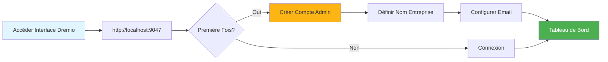
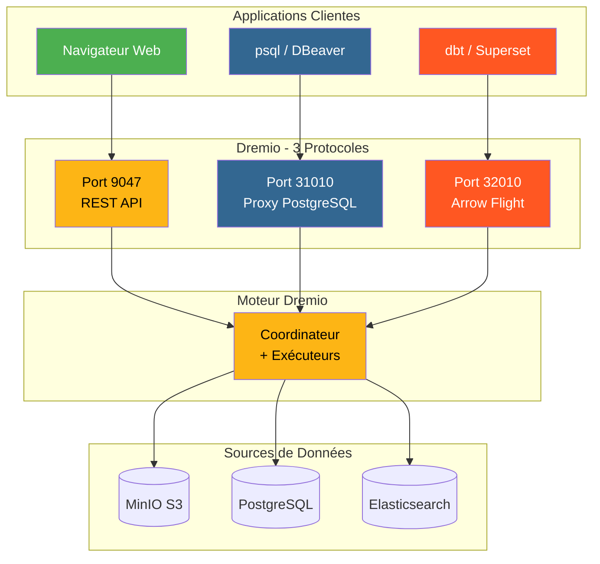
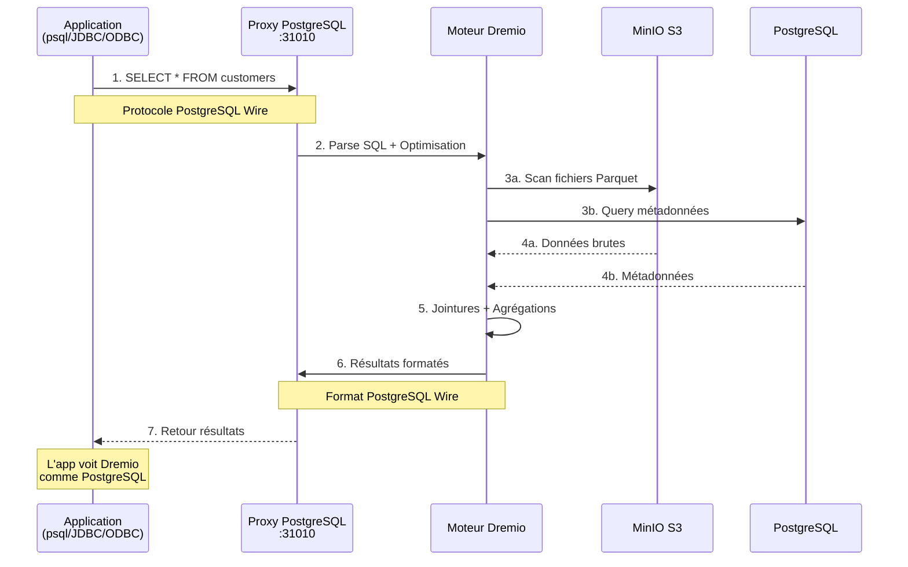
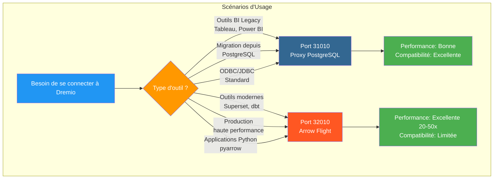
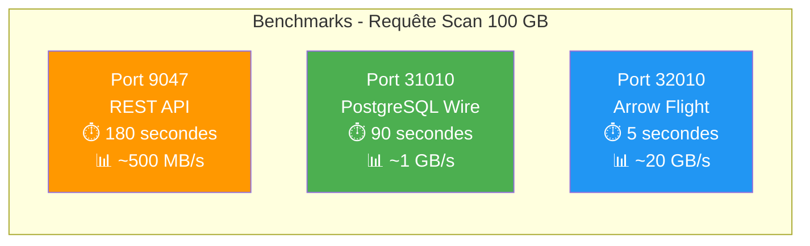
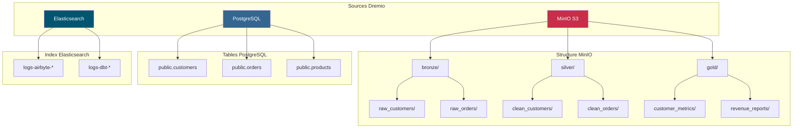
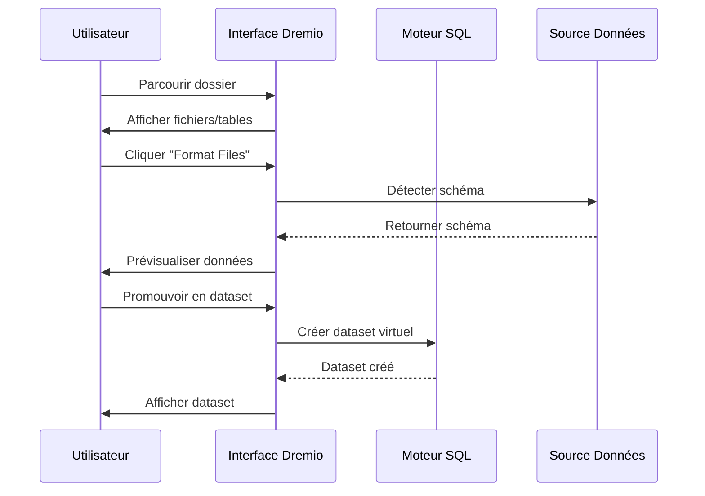
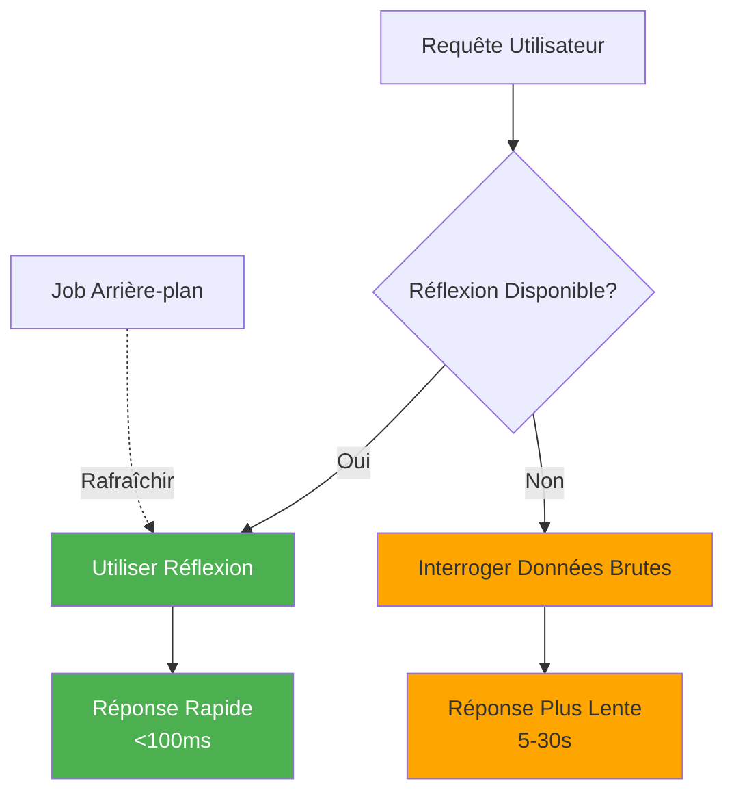

# Hướng dẫn cấu hình Dremio

**Phiên bản**: 3.2.0  
**Cập nhật lần cuối**: Ngày 16 tháng 10 năm 2025  
**Ngôn ngữ**: Tiếng Pháp

## Mục lục

1. [Tổng quan](#tổng quan)
2. [Cấu hình ban đầu](#cấu hình ban đầu)
3. [Cấu hình nguồn dữ liệu](#data-source-configuration)
4. [Bộ dữ liệu ảo](#bộ dữ liệu ảo)
5. [Suy nghĩ (Truy vấn tăng tốc)](#thoughts-acceleration-queries)
6. [Kiểm soát bảo mật và truy cập](#security-and-access-control)
7. [Tối ưu hóa hiệu suất](#performance-optimization)
8. [Tích hợp với dbt](#integration-with-dbt)
9. [Giám sát và bảo trì](#giám sát và bảo trì)
10. [Xử lý sự cố](#khắc phục sự cố)

---

## Tổng quan

Dremio là nền tảng kho dữ liệu cung cấp giao diện thống nhất để truy vấn dữ liệu trên nhiều nguồn. Hướng dẫn này bao gồm mọi thứ từ thiết lập ban đầu đến các kỹ thuật tối ưu hóa nâng cao.

### Dremio là gì?

Dremio kết hợp tính linh hoạt của hồ dữ liệu với hiệu suất của kho dữ liệu:

- **Ảo hóa dữ liệu**: Truy vấn dữ liệu mà không cần di chuyển hoặc sao chép dữ liệu
- **Tăng tốc truy vấn**: Bộ nhớ đệm tự động có phản ánh
- **Phân tích tự phục vụ**: Người dùng doanh nghiệp có thể trực tiếp khám phá dữ liệu
- **Tiêu chuẩn SQL**: Không có ngôn ngữ truy vấn độc quyền
- **Mũi tên Apache**: Định dạng cột hiệu suất cao

### Các tính năng chính

| Tính năng | Mô tả | Lợi nhuận |
|-------|----------|---------|
| **Suy nghĩ** | Tăng tốc truy vấn thông minh | Truy vấn nhanh hơn 10-100 lần |
| **Ảo hóa dữ liệu** | Chế độ xem thống nhất về nguồn | Không trùng lặp dữ liệu |
| **Chuyến bay mũi tên** | Truyền dữ liệu tốc độ cao | Nhanh hơn 20-50 lần so với ODBC/JDBC |
| **Lớp ngữ nghĩa** | Tên lĩnh vực định hướng kinh doanh | Phân tích tự phục vụ |
| **Git cho dữ liệu** | Kiểm soát phiên bản tập dữ liệu | Hợp tác và khôi phục |

---

## Cấu hình ban đầu

### Điều kiện tiên quyết

Trước khi bắt đầu, hãy đảm bảo bạn có:
- Đang chạy bộ chứa Dremio (xem [Hướng dẫn cài đặt](../getting-started/installation.md))
- Truy cập vào các nguồn dữ liệu (MinIO, PostgreSQL, v.v.)
- Thông tin đăng nhập của quản trị viên

### Kết nối đầu tiên



#### Bước 1: Truy cập giao diện Dremio

Mở trình duyệt của bạn và điều hướng đến:
```
http://localhost:9047
```

#### Bước 2: Tạo tài khoản quản trị

Trong lần khởi chạy đầu tiên, bạn sẽ được nhắc tạo tài khoản quản trị viên:

```
Nom d'utilisateur: admin
Prénom: Admin
Nom: Utilisateur
Email: admin@example.com
Mot de passe: [mot de passe sécurisé]
```

**Lưu ý bảo mật**: Sử dụng mật khẩu mạnh có ít nhất 12 ký tự, bao gồm chữ hoa, chữ thường, số và ký tự đặc biệt.

#### Bước 3: Thiết lập ban đầu

```json
{
  "companyName": "Votre Organisation",
  "supportEmail": "support@talentys.eu",
  "supportKey": "votre-clé-support-si-entreprise"
}
```

### Tệp cấu hình

Cấu hình Dremio được quản lý thông qua `dremio.conf`:

```conf
# dremio.conf

paths: {
  local: "/opt/dremio/data"
  dist: "dremioS3:///dremio-data"
}

services: {
  coordinator.enabled: true
  coordinator.master.enabled: true
  
  executor.enabled: true
  
  # Paramètres mémoire
  coordinator.master.heap_memory_mb: 4096
  executor.heap_memory_mb: 8192
}

# Configuration réseau
services.coordinator.web.port: 9047
services.coordinator.client.port: 31010
services.coordinator.flight.port: 32010

# Ajustement performance
store.plugin.max_metadata_leaf_columns: 800
planner.enable_broadcast_join: true
planner.slice_target: 100000
```

### Biến môi trường

```bash
# Section environment de docker-compose.yml
environment:
  - DREMIO_JAVA_SERVER_EXTRA_OPTS=-Xms2g -Xmx4g
  - DREMIO_JAVA_FLIGHT_EXTRA_OPTS=-Xms1g -Xmx2g
  - DREMIO_MAX_MEMORY_SIZE_MB=8192
  - DREMIO_HOME=/opt/dremio
```

### Kết nối qua Proxy PostgreSQL

Dremio hiển thị giao diện tương thích PostgreSQL trên cổng 31010, cho phép các công cụ tương thích PostgreSQL kết nối mà không cần sửa đổi.

#### Kiến trúc kết nối Dremio



#### Luồng truy vấn qua Proxy PostgreSQL



#### Cấu hình proxy

Proxy PostgreSQL được bật tự động trong `dremio.conf`:

```conf
# Configuration du proxy PostgreSQL (ODBC/JDBC)
services.coordinator.client.port: 31010
```

#### Kết nối với psql

```bash
# Connexion directe avec psql
psql -h localhost -p 31010 -U admin -d datalake

# Exemple de requête
psql -h localhost -p 31010 -U admin -d datalake -c "SELECT * FROM MinIO.datalake.customers LIMIT 10;"
```

#### Kết nối với DBeaver/pgAdmin

Thiết lập kết nối:

```yaml
Type: PostgreSQL
Host: localhost
Port: 31010
Database: datalake
Username: admin
Password: <votre-mot-de-passe>
SSL: Désactivé (en développement)
```

####Kênh kết nối

**JDBC:**
```java
String url = "jdbc:postgresql://localhost:31010/datalake";
Properties props = new Properties();
props.setProperty("user", "admin");
props.setProperty("password", "votre-mot-de-passe");
Connection conn = DriverManager.getConnection(url, props);
```

**ODBC (DSN):**
```ini
[Dremio via PostgreSQL]
Driver=PostgreSQL Unicode
Server=localhost
Port=31010
Database=datalake
Username=admin
Password=<votre-mot-de-passe>
SSLMode=disable
```

**Python (psycopg2):**
```python
import psycopg2

conn = psycopg2.connect(
    host="localhost",
    port=31010,
    database="datalake",
    user="admin",
    password="votre-mot-de-passe"
)

cursor = conn.cursor()
cursor.execute("SELECT * FROM MinIO.datalake.customers LIMIT 10")
rows = cursor.fetchall()
```

#### Khi nào nên sử dụng Proxy PostgreSQL



| Kịch bản | Sử dụng Proxy PostgreSQL | Sử dụng Mũi tên Bay |
|----------|-----------------------------|----------------------|
| **BI Legacy Tools** (không hỗ trợ Arrow Flight) | ✅ Có | ❌ Không |
| **Di chuyển từ PostgreSQL** (mã JDBC/ODBC hiện có) | ✅ Có | ❌ Không |
| **Sản xuất hiệu suất cao** | ❌ Không | ✅ Có (nhanh hơn 20-50 lần) |
| **Superset, dbt, công cụ hiện đại** | ❌ Không | ✅ Có |
| **Phát triển/thử nghiệm nhanh** | ✅ Có (quen thuộc) | ⚠️ Cả hai đều ổn |

####So sánh hiệu năng của 3 cổng



**Đề xuất**: Sử dụng proxy PostgreSQL (cổng 31010) để có **khả năng tương thích** và Arrow Flight (cổng 32010) để có **hiệu suất sản xuất**.

---

## Định cấu hình nguồn dữ liệu

### Thêm Nguồn MinIO S3

MinIO là kho lưu trữ hồ dữ liệu chính của bạn.

#### Bước 1: Điều hướng đến Nguồn

```
Interface Dremio → Datasets → Add Source → Object Storage → Amazon S3
```

#### Bước 2: Cấu hình kết nối S3

```json
{
  "name": "MinIO",
  "config": {
    "credentialType": "ACCESS_KEY",
    "accessKey": "minioadmin",
    "accessSecret": "minioadmin",
    "secure": false,
    "externalBucketList": [
      "datalake"
    ],
    "enableAsync": true,
    "compatibilityMode": true,
    "rootPath": "/",
    "defaultCtasFormat": "PARQUET",
    "propertyList": [
      {
        "name": "fs.s3a.path.style.access",
        "value": "true"
      },
      {
        "name": "fs.s3a.endpoint",
        "value": "minio:9000"
      },
      {
        "name": "dremio.s3.compat",
        "value": "true"
      }
    ]
  }
}
```

#### Bước 3: Kiểm tra kết nối

```sql
-- Requête test pour vérifier connexion MinIO
SELECT * FROM MinIO.datalake.bronze.customers LIMIT 10;
```

**Kết quả mong đợi**:
```
customer_id | name           | email
------------|----------------|------------------
1           | John Doe       | john@example.com
2           | Jane Smith     | jane@example.com
...
```

### Thêm nguồn PostgreSQL

#### Cài đặt

```
Interface Dremio → Datasets → Add Source → Relational → PostgreSQL
```

```json
{
  "name": "PostgreSQL",
  "config": {
    "hostname": "postgres",
    "port": "5432",
    "databaseName": "datawarehouse",
    "username": "postgres",
    "password": "postgres",
    "authenticationType": "MASTER",
    "fetchSize": 2000,
    "encryptionValidationMode": "CERTIFICATE_AND_HOSTNAME_VALIDATION"
  }
}
```

### Thêm nguồn Elaticsearch

```json
{
  "name": "Elasticsearch",
  "config": {
    "hostList": [
      {"hostname": "elasticsearch", "port": 9200}
    ],
    "authenticationType": "ANONYMOUS",
    "scrollSize": 4000,
    "scrollTimeout": 60000,
    "scriptsEnabled": true,
    "showHiddenIndices": false,
    "showIdColumn": false
  }
}
```

### Tổ chức nguồn



---

## Bộ dữ liệu ảo

Bộ dữ liệu ảo cho phép bạn tạo các chế độ xem được chuyển đổi và tái sử dụng cho dữ liệu của mình.

### Tạo bộ dữ liệu ảo

#### Từ Trình soạn thảo SQL

```sql
-- Créer dataset jointif
SELECT 
    c.customer_id,
    c.name,
    c.email,
    c.state,
    COUNT(o.order_id) as total_orders,
    SUM(o.amount) as lifetime_value
FROM MinIO.datalake.silver.customers c
LEFT JOIN MinIO.datalake.silver.orders o
    ON c.customer_id = o.customer_id
GROUP BY c.customer_id, c.name, c.email, c.state;

-- Sauvegarder comme dataset virtuel: "customer_summary"
```

**Lưu vị trí**:
```
@username → customer_summary
```

#### Từ giao diện



**Các bước**:
1. Điều hướng đến nguồn MinIO
2. Duyệt đến `datalake/bronze/customers/`
3. Nhấp vào nút “Định dạng tệp”
4. Kiểm tra mẫu được phát hiện
5. Nhấp vào “Lưu” để quảng bá vào tập dữ liệu

### Tổ chức bộ dữ liệu

Tạo cấu trúc logic với Spaces và Folders:

```
Dremio
├── @admin (Espace Personnel)
│   └── dev (Dossier)
│       ├── test_customers
│       └── test_orders
├── Production (Espace Partagé)
│   ├── Dimensions (Dossier)
│   │   ├── dim_customers
│   │   ├── dim_products
│   │   └── dim_dates
│   └── Facts (Dossier)
│       ├── fct_orders
│       ├── fct_revenue
│       └── fct_customer_lifetime_value
└── Analytics (Espace Partagé)
    ├── customer_metrics
    ├── sales_dashboard_data
    └── marketing_attribution
```

### Lớp ngữ nghĩa

Thêm tên và mô tả theo định hướng kinh doanh:

```sql
-- Noms colonnes techniques originaux
SELECT
    cust_id,
    cust_nm,
    cust_em,
    crt_dt
FROM raw.customers;

-- Créer dataset virtuel avec noms sémantiques
SELECT
    cust_id AS "ID Client",
    cust_nm AS "Nom Client",
    cust_em AS "Adresse Email",
    crt_dt AS "Date Inscription"
FROM raw.customers;
```

**Thêm mô tả**:
```
Interface → Dataset → Colonne → Éditer Description

ID Client: Identifiant unique pour chaque client
Nom Client: Nom complet du client
Adresse Email: Email principal pour communication
Date Inscription: Date inscription client sur plateforme
```

---

## Phản ánh (Truy vấn tăng tốc)

Phản ánh là cơ chế lưu vào bộ nhớ đệm thông minh của Dremio giúp cải thiện đáng kể hiệu suất truy vấn.

### Các loại phản xạ

#### 1. Phản ánh thô

Lưu trữ tập hợp con các cột để truy xuất nhanh:

```sql
-- Créer réflexion brute
CREATE REFLECTION raw_customer_base
ON Production.Dimensions.dim_customers
USING DISPLAY (
    customer_id,
    name,
    email,
    state,
    registration_date
);
```

**Trường hợp sử dụng**:
- Bảng điều khiển truy vấn các cột cụ thể
- Báo cáo với tập hợp con cột
- Truy vấn thăm dò

#### 2. Phản ánh tổng hợp

Tính toán tổng hợp trước để có kết quả tức thì:

```sql
-- Créer réflexion agrégation
CREATE REFLECTION agg_daily_revenue
ON Production.Facts.fct_orders
USING 
  DIMENSIONS (order_date, product_id, region)
  MEASURES (
    SUM(amount),
    COUNT(*),
    AVG(amount),
    MIN(amount),
    MAX(amount)
  );
```

**Trường hợp sử dụng**:
- Bảng điều khiển điều hành
- Báo cáo tổng hợp
- Phân tích xu hướng

### Phản ánh cấu hình



#### Chính sách giải khát

```
Interface → Dataset → Settings → Reflections → Refresh Policy
```

**Tùy chọn**:
- **Không bao giờ làm mới**: Dữ liệu tĩnh (ví dụ: kho lưu trữ lịch sử)
- **Làm mới mỗi [1 giờ]**: Cập nhật định kỳ
- **Làm mới khi tập dữ liệu thay đổi**: Đồng bộ hóa thời gian thực

```json
{
  "refreshPolicy": {
    "method": "PERIOD",
    "refreshPeriod": 3600000,  // 1 heure en millisecondes
    "gracePeriod": 10800000    // 3 heures
  }
}
```

#### Chính sách hết hạn

```json
{
  "expirationPolicy": {
    "method": "NEVER",
    // ou
    "method": "AFTER_PERIOD",
    "expirationPeriod": 604800000  // 7 jours
  }
}
```

### Những phương pháp hay để suy ngẫm

#### 1. Bắt đầu với các truy vấn có giá trị cao

Xác định các truy vấn chậm từ lịch sử:

```sql
-- Interroger historique jobs pour trouver requêtes lentes
SELECT 
    query_text,
    execution_time_ms,
    dataset_path
FROM sys.jobs
WHERE execution_time_ms > 5000  -- Plus lent que 5 secondes
ORDER BY execution_time_ms DESC
LIMIT 100;
```

#### 2. Tạo các phản ánh có mục tiêu

```sql
-- Mauvais: Réflexion avec trop de dimensions
CREATE REFLECTION too_broad
USING DIMENSIONS (col1, col2, col3, col4, col5, col6)
MEASURES (SUM(amount));

-- Bon: Réflexion ciblée pour cas d'usage spécifique
CREATE REFLECTION targeted
USING DIMENSIONS (order_date, product_category)
MEASURES (SUM(revenue), COUNT(DISTINCT customer_id));
```

#### 3. Giám sát phản ánh vùng phủ sóng

```sql
-- Vérifier quelles requêtes sont accélérées
SELECT 
    query_text,
    acceleration_profile.accelerated,
    acceleration_profile.reflection_ids
FROM sys.jobs
WHERE start_time > CURRENT_DATE - INTERVAL '7' DAY;
```

### Tác động đến suy nghĩ về hiệu suất

| Kích thước tập dữ liệu | Nhập truy vấn | Không có sự phản ánh | Với Sự Phản Chiếu | Tăng tốc |
|-------|--------------------------|----------------|----------------|-------------|
| 1M dòng | CHỌN Đơn giản | 500 mili giây | 50 mili giây | 10 lần |
| 10M dòng | Tổng hợp | 15 giây | 200 mili giây | 75x |
| 100M dòng | THAM GIA phức hợp | 2 phút | 1 giây | 120x |
| dòng 1B | NHÓM THEO | 10 phút | 5 giây | 120x |

---

## Kiểm soát bảo mật và truy cập

### Quản lý người dùng

#### Tạo người dùng

```
Interface → Account Settings → Users → Add User
```

```json
{
  "username": "analyst_user",
  "firstName": "Data",
  "lastName": "Analyst",
  "email": "analyst@example.com",
  "password": "secure_password"
}
```

#### Vai trò của người dùng

| Vai trò | Quyền | Trường hợp sử dụng |
|------|-------------|-------------|
| **Quản trị viên** | Toàn quyền truy cập | Quản trị hệ thống |
| **Người dùng** | Truy vấn, tạo bộ dữ liệu cá nhân | Nhà phân tích, nhà khoa học dữ liệu |
| **Người dùng bị hạn chế** | Chỉ truy vấn, không tạo tập dữ liệu | Người dùng doanh nghiệp, người xem |

### Quyền không gian

```
Interface → Space → Settings → Privileges
```

**Các loại quyền**:
- **View**: Có thể xem và truy vấn các tập dữ liệu
- **Sửa đổi**: Có thể chỉnh sửa định nghĩa tập dữ liệu
- **Quản lý tài trợ**: Có thể quản lý quyền
- **Chủ sở hữu**: Kiểm soát hoàn toàn

**Ví dụ**:
```
Espace: Production
├── Équipe Analytics → View, Modify
├── Data Engineers → Owner
└── Exécutifs → View
```

### Mức độ an toàn của đường dây

Thực hiện lọc cấp hàng:

```sql
-- Créer vue avec filtre niveau ligne
CREATE VDS customer_data_filtered AS
SELECT *
FROM Production.Dimensions.dim_customers
WHERE 
  CASE 
    WHEN CURRENT_USER = 'admin' THEN TRUE
    WHEN region = (
      SELECT home_region 
      FROM users 
      WHERE username = CURRENT_USER
    ) THEN TRUE
    ELSE FALSE
  END;
```

### Cột cấp độ bảo mật

Ẩn các cột nhạy cảm:

```sql
-- Masquer données sensibles pour utilisateurs non-admin
CREATE VDS customer_data_masked AS
SELECT
    customer_id,
    name,
    CASE 
      WHEN CURRENT_USER IN ('admin', 'data_engineer')
      THEN email
      ELSE CONCAT(SUBSTRING(email, 1, 3), '***@***.com')
    END AS email,
    state
FROM Production.Dimensions.dim_customers;
```

### Tích hợp OAuth

```conf
# dremio.conf
services.coordinator.web.auth.type: "oauth"
services.coordinator.web.auth.oauth.providerId: "okta"
services.coordinator.web.auth.oauth.clientId: "your-client-id"
services.coordinator.web.auth.oauth.clientSecret: "your-client-secret"
services.coordinator.web.auth.oauth.authorizeUrl: "https://your-domain.okta.com/oauth2/v1/authorize"
services.coordinator.web.auth.oauth.tokenUrl: "https://your-domain.okta.com/oauth2/v1/token"
```

---

## Tối ưu hóa hiệu suất

### Kỹ thuật tối ưu hóa truy vấn

#### 1. Cắt tỉa phân vùng

```sql
-- Mauvais: Scanne toutes les données
SELECT * FROM orders
WHERE amount > 100;

-- Bon: Élague partitions
SELECT * FROM orders
WHERE order_date >= '2025-10-01'
  AND order_date < '2025-11-01'
  AND amount > 100;
```

#### 2. Cắt tỉa cột

```sql
-- Mauvais: Lit toutes les colonnes
SELECT * FROM large_table LIMIT 100;

-- Bon: Lit uniquement colonnes nécessaires
SELECT customer_id, name, email 
FROM large_table 
LIMIT 100;
```

#### 3. Đẩy lùi vị ngữ

```sql
-- Filtres poussés vers couche stockage
SELECT c.name, o.amount
FROM customers c
JOIN orders o ON c.customer_id = o.customer_id
WHERE o.order_date >= CURRENT_DATE - INTERVAL '30' DAY;
-- Filtre appliqué avant jointure
```

#### 4. Tối ưu hóa tham gia

```sql
-- Utiliser broadcast join pour petites dimensions
SELECT /*+ BROADCAST(d) */
    f.order_id,
    d.product_name,
    f.amount
FROM facts.orders f
JOIN dimensions.products d
    ON f.product_id = d.product_id;
```

### Cấu hình bộ nhớ

```conf
# dremio.conf

# Augmenter mémoire pour grandes requêtes
services.executor.heap_memory_mb: 32768

# Configurer spill to disk
spill.directory: "/opt/dremio/spill"
spill.enable: true

# Limites mémoire requête
planner.memory.max_query_memory_per_node: 10737418240  # 10GB
planner.memory.query_max_cost: 1000000000
```

### Định cỡ cụm

| Loại tải | Điều phối viên | Người thi hành | Tổng số cụm |
|-------------|----------|-------------|---------------|
| **Nhỏ** | 4 CPU, 16 GB | 2x (8 CPU, 32 GB) | 20 CPU, 80 GB |
| **Trung bình** | 8 CPU, 32 GB | 4x (16 CPU, 64 GB) | CPU 72, 288 GB |
| **Lớn** | 16 CPU, 64 GB | 8x (CPU 32, 128 GB) | 272 CPU, 1088 GB |

### Giám sát hiệu suất

```sql
-- Analyser performance requête
SELECT 
    query_id,
    query_text,
    start_time,
    execution_time_ms / 1000.0 AS execution_time_seconds,
    planner_estimated_cost,
    rows_returned,
    acceleration_profile.accelerated
FROM sys.jobs
WHERE start_time > CURRENT_DATE - INTERVAL '1' DAY
ORDER BY execution_time_ms DESC
LIMIT 20;
```

---

## Tích hợp với dbt

### Dremio trong vai Target dbt

Định cấu hình `profiles.yml`:

```yaml
# profiles.yml
dremio_project:
  target: dev
  outputs:
    dev:
      type: dremio
      threads: 4
      host: localhost
      port: 9047
      username: admin
      password: "{{ env_var('DREMIO_PASSWORD') }}"
      use_ssl: false
      space: "@admin"
      
    prod:
      type: dremio
      threads: 8
      host: dremio.example.com
      port: 443
      username: dbt_service_account
      password: "{{ env_var('DREMIO_PASSWORD') }}"
      use_ssl: true
      space: "Production"
```

### mô hình dbt trên Dremio

```sql
-- models/staging/stg_customers.sql
{{
    config(
        materialized='view',
        alias='stg_customers'
    )
}}

SELECT
    customer_id,
    TRIM(UPPER(name)) AS customer_name,
    LOWER(email) AS email,
    state,
    created_at
FROM {{ source('minio', 'raw_customers') }}
WHERE customer_id IS NOT NULL
```

### Khai thác phản ánh trong dbt

```sql
-- models/marts/fct_customer_metrics.sql
{{
    config(
        materialized='table',
        post_hook=[
            "ALTER VDS {{ this }} ENABLE RAW REFLECTION",
            "ALTER VDS {{ this }} ENABLE AGGREGATION REFLECTION 
             USING DIMENSIONS (customer_id, registration_month) 
             MEASURES (SUM(lifetime_value), COUNT(*))"
        ]
    )
}}

SELECT
    customer_id,
    DATE_TRUNC('month', registration_date) AS registration_month,
    COUNT(DISTINCT order_id) AS total_orders,
    SUM(order_amount) AS lifetime_value
FROM {{ ref('int_customer_orders') }}
GROUP BY customer_id, DATE_TRUNC('month', registration_date)
```

---

## Giám sát và bảo trì

### Các số liệu chính cần theo dõi

```yaml
metrics:
  - name: Performance Requête
    query: "SELECT AVG(execution_time_ms) FROM sys.jobs WHERE start_time > NOW() - INTERVAL '1' HOUR"
    threshold: 5000  # Alerte si moyenne > 5 secondes
    
  - name: Couverture Réflexion
    query: "SELECT COUNT(*) FILTER (WHERE accelerated = true) * 100.0 / COUNT(*) FROM sys.jobs WHERE start_time > NOW() - INTERVAL '1' DAY"
    threshold: 80  # Alerte si couverture < 80%
    
  - name: Requêtes Échouées
    query: "SELECT COUNT(*) FROM sys.jobs WHERE query_state = 'FAILED' AND start_time > NOW() - INTERVAL '1' HOUR"
    threshold: 10  # Alerte si > 10 échecs par heure
```

### Nhiệm vụ bảo trì

#### 1. Làm mới suy nghĩ

```sql
-- Rafraîchir manuellement réflexion
ALTER REFLECTION reflection_id REFRESH;

-- Reconstruire toutes réflexions pour dataset
ALTER VDS Production.Facts.fct_orders 
REFRESH ALL REFLECTIONS;
```

#### 2. Dọn dẹp dữ liệu cũ

```sql
-- Nettoyer historique requêtes
DELETE FROM sys.jobs
WHERE start_time < CURRENT_DATE - INTERVAL '90' DAY;

-- Compacter métadonnées (Enterprise uniquement)
VACUUM CATALOG;
```

#### 3. Cập nhật thống kê

```sql
-- Rafraîchir statistiques table
ANALYZE TABLE MinIO.datalake.silver.customers;

-- Mettre à jour métadonnées dataset
REFRESH DATASET MinIO.datalake.silver.customers;
```

---

## Khắc phục sự cố

### Các vấn đề thường gặp

#### Vấn đề 1: Hiệu suất truy vấn chậm

**Triệu chứng**: Truy vấn mất vài phút thay vì vài giây

**Chẩn đoán**:
```sql
-- Vérifier profil requête
SELECT * FROM sys.jobs WHERE job_id = 'your-job-id';

-- Vérifier si réflexion utilisée
SELECT acceleration_profile FROM sys.jobs WHERE job_id = 'your-job-id';
```

**Giải pháp**:
1. Tạo ra những suy nghĩ phù hợp
2. Thêm bộ lọc cắt bớt phân vùng
3. Tăng bộ nhớ thực thi
4. Kích hoạt tính năng xếp hàng đợi

#### Vấn đề 2: Sự phản ánh không xây dựng được

**Triệu chứng**: Hình ảnh phản chiếu bị kẹt ở trạng thái "ĐANG LÀM MỚI"

**Chẩn đoán**:
```sql
-- Vérifier statut réflexion
SELECT * FROM sys.reflections WHERE status != 'ACTIVE';

-- Vérifier erreurs réflexion
SELECT * FROM sys.reflection_dependencies;
```

**Giải pháp**:
1. Kiểm tra dữ liệu nguồn để biết các thay đổi trong lược đồ
2. Kiểm tra đủ dung lượng đĩa
3. Tăng phản ánh thời gian chờ xây dựng
4. Tắt và kích hoạt lại tính năng phản chiếu

#### Vấn đề 3: Hết thời gian kết nối

**Triệu chứng**: Lỗi “Hết thời gian kết nối” khi truy vấn nguồn

**Giải pháp**:
```conf
# dremio.conf
store.plugin.keep_alive_ms: 30000
store.plugin.timeout_ms: 120000
```

#### Vấn đề 4: Thiếu bộ nhớ

**Triệu chứng**: "OutOfMemoryError" trong nhật ký

**Giải pháp**:
```conf
# Augmenter taille heap
services.executor.heap_memory_mb: 65536

# Activer spill to disk
spill.enable: true
spill.directory: "/opt/dremio/spill"
```

### Truy vấn chẩn đoán

```sql
-- Requêtes actives
SELECT query_id, query_text, start_time, user_name
FROM sys.jobs
WHERE query_state = 'RUNNING';

-- Utilisation ressources par utilisateur
SELECT 
    user_name,
    COUNT(*) as query_count,
    AVG(execution_time_ms) as avg_execution_ms,
    SUM(rows_returned) as total_rows
FROM sys.jobs
WHERE start_time > CURRENT_DATE
GROUP BY user_name;

-- Modèles accès dataset
SELECT 
    dataset_path,
    COUNT(*) as access_count,
    COUNT(DISTINCT user_name) as unique_users
FROM sys.jobs
WHERE start_time > CURRENT_DATE - INTERVAL '7' DAY
GROUP BY dataset_path
ORDER BY access_count DESC
LIMIT 20;
```

---

## Bản tóm tắt

Hướng dẫn toàn diện này bao gồm:

- **Cấu hình ban đầu**: Cấu hình lần đầu, tạo tài khoản quản trị viên, file cấu hình
- **Nguồn dữ liệu**: Kết nối MiniIO, PostgreSQL và Elaticsearch
- **Bộ dữ liệu ảo**: Tạo các chế độ xem được chuyển đổi có thể sử dụng lại bằng lớp ngữ nghĩa
- **Phản ánh**: Phản ánh thô và tổng hợp để tăng tốc truy vấn 10-100 lần
- **Bảo mật**: Quản lý người dùng, quyền không gian, bảo mật cấp hàng/cột
- **Hiệu suất**: Tối ưu hóa truy vấn, cấu hình bộ nhớ, định cỡ cụm
- **tích hợp dbt**: Sử dụng Dremio làm mục tiêu dbt với tính năng quản lý phản ánh
- **Giám sát**: Các số liệu chính, nhiệm vụ bảo trì, yêu cầu chẩn đoán
- **Xử lý sự cố**: Các sự cố thường gặp và giải pháp

Những điểm chính cần nhớ:
- Dremio cung cấp giao diện SQL thống nhất trên tất cả các nguồn dữ liệu
- Những suy nghĩ cần thiết cho hiệu suất sản xuất
- Cấu hình bảo mật phù hợp cho phép phân tích tự phục vụ
- Giám sát thường xuyên đảm bảo hiệu suất tối ưu

**Tài liệu liên quan:**
- [Thành phần kiến ​​trúc](../architecture/comComponents.md)
- [Luồng dữ liệu](../architecture/data-flow.md)
- [Hướng dẫn phát triển dbt](./dbt-development.md)
- [Tích hợp Airbyte](./airbyte-integration.md)

---

**Phiên bản**: 3.2.0  
**Cập nhật lần cuối**: Ngày 16 tháng 10 năm 2025